## **Preparation for Python(Windows)**

**1. Install Thonny：**

Thonny is a free and open source software platform with small size,
simple interface, simple operation and rich functions. It is a Python
IDE suitable for beginners. In this tutorial, we use this IDE to develop
a ESP32. Thonny supports multiple operating systems including Windows,
Mac OS, Linux.

1.  **Download Thonny：**

<!-- -->

1.  Enter the website：[https://thonny.org](https://thonny.org) to
    download the latest version of Thonny.

    (2)Thonny open-source code library：[https://github.com/thonny/thonny](https://github.com/thonny/thonny)

<table>
<tbody>
<tr class="odd">
<td>System</td>
<td>Download link</td>
</tr>
<tr class="even">
<td>MAC OS：</td>
<td><a href="https://github.com/thonny/thonny/releases/download/v3.2.7/thonny-3.2.7.pkg">https://github.com/thonny/thonny/releases/download/v3.2.7/thonny-3.2.7.pkg</a></td>
</tr>
<tr class="odd">
<td>Windows：</td>
<td><a href=" https:/github.com/thonny/thonny/releases/download/v3.2.7/thonny-3.2.7.exe">https://github.com/thonny/thonny/releases/download/v3.2.7/thonny-3.2.7.exe</a></td>
</tr>
<tr class="even">
<td>Linux：</td>
<td>
Latest version:

<strong>Binary bundle for PC (Thonny+Python):</strong>

bash &lt;(wget -O - https://thonny.org/installer-for-linux)

<strong>With pip:</strong>

pip3 install thonny

<strong>Distro packages (may not be the latest version):</strong>

<strong>Debian, Rasbian, Ubuntu, Mint and others:</strong>

sudo apt install thonny

<strong>Fedora:</strong>

sudo dnf install thonny
</td>
</tr>
</tbody>
</table>

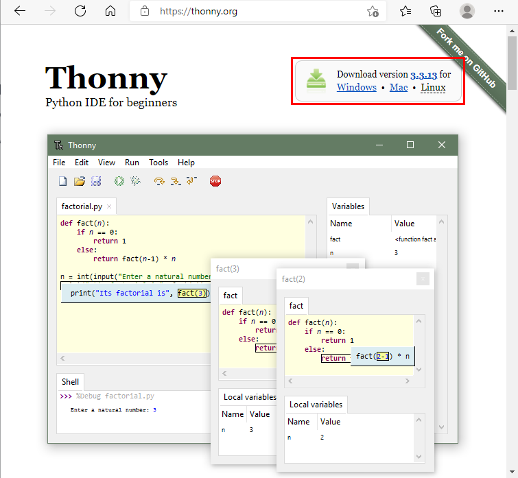

1.  **Windows System**

    
    

<!-- -->

1.  Double-click“thonny-3.3.13.exe”and select install mode

    You can choose 
     or
    
    

    
    

2.  You can also keep selecting **Next** to finish install

    
    

    
    

3.  If you want to change the route of installing Thonny，just
    click“**Browse...**”to select a new route and click **OK**.

    

    
    

4.  Click **Create desktop icon,** you will view Thonny on your desktop

1.  Click“**Install**”

    
    

2.  Wait for a while but don’t click **Cancel**

    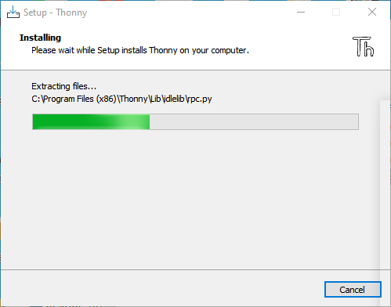
    

    G. Click**“Finish”**

    
    

    
    

<!-- -->

1.  **Basic Setting：**

    Double-click Thonny, choose lanuage and initial settings and click
    **Let’s go！**

    
    

    

    
    

<!-- -->

1.  Click“**View**”→“**File**”and“**Shell**”

    
    

    
    

    
    

    **Install the CP2102 driver：**

    Before using the Thonny, we need to install the CP2102 driver in the
    computer.

**Windows system**

Check if the CP2102 driver has been installed

1. Interface the ESP32 with your PC with a USB cable

2. Click“This PC”and right-click Manage”

1.  Click“Device Manager”, if the CP2102driver has been
    installed，Silicon Labs CP210x USB to UART Bridge(COMx) will be
    shown.

    
    

    If the CP2102 has not been installed

    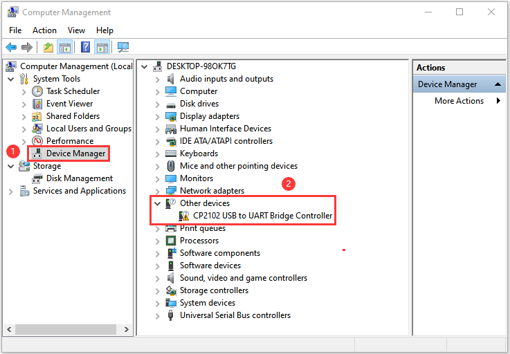
    

    Click“CP2102USB to UART Bridge Controller”and Update driver”。

    
    

<!-- -->

1.  Click“Browse my computer for drivers ”.

    
    

    Click Browse... to choose Python Tutorials\\1. Get started with
    Python\\CP2102 Driver File-Windows and click Next

    
    

    The CP2102 driver will be installed

    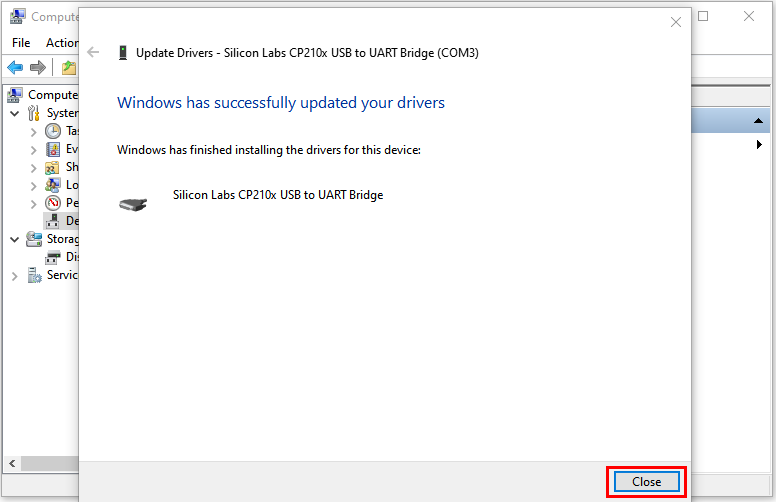
    

    
    

MAC System

You can refer to the file **Get started with Arduino** in the folder

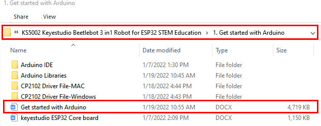

**3. Burn Micropython firmware**

To run a Python program on the ESP32 board, we need to burn the firmware
to the ESP32 board first.

Download Micropython firmware

microPython website：<http://micropython.org/>

ESP32 firmware：[https://micropython.org/download/esp32/](https://micropython.org/download/esp32/)

The firmware we use：**esp32-20210902-v1.17.bin**

Download
firmware：[https://micropython.org/resources/firmware/esp32-20210902-v1.17.bin](https://micropython.org/resources/firmware/esp32-20220117-v1.18.bin)

Firmware：Keyestudio Beetlebot 3 in1 Robot for ESP32 STEM Education\\5.
Python Tutorials\\1. Get started with Python\\Python\_Firmware.

Burn the Micropython firmware

Connect the ESP32 to your PC with a USB
cable

Make sure the driver has been installed successfully and the COM port
shown. Open Device Manager and click

.

1. Open Thonny，click“run”and“Select interpreter...”

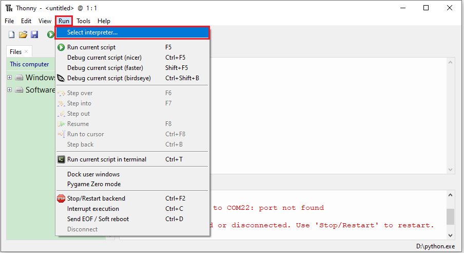

Select Micropython (ESP32) and Silicon Labs CP210x USB to UART
Bridge(COM3) and click Install or update firmware.

Select“Silicon Labs CP210x USB to UART
Bridge(COM3)”，click“Browse...”and choose the firmware
**esp32-20210902-v1.17.bin**

Check Erase flash before installing and Flash mode，then click“Install”

(Note：if you fail to install the firmware，press the Boot on the ESP32
board and click“Install”）

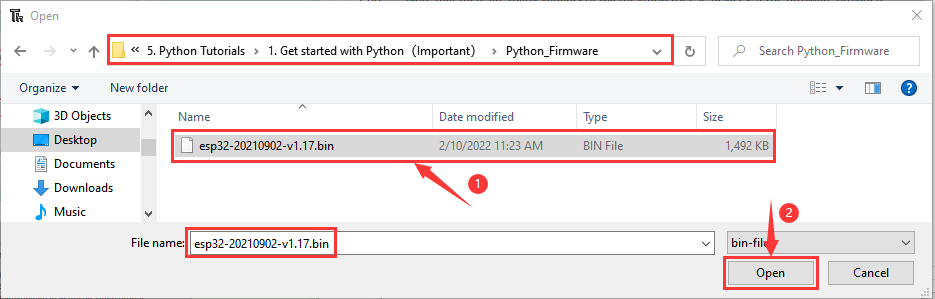

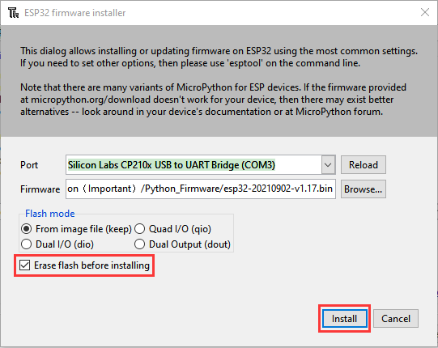

Then click Close and OK

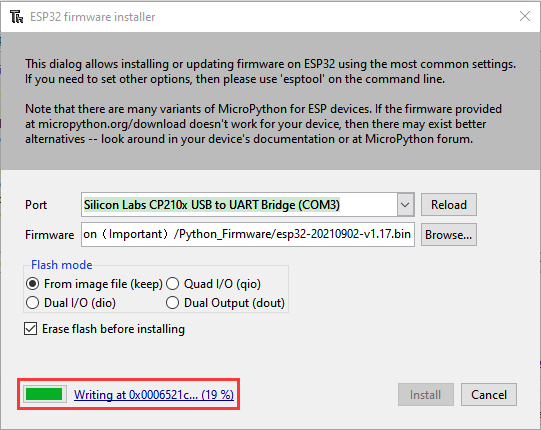

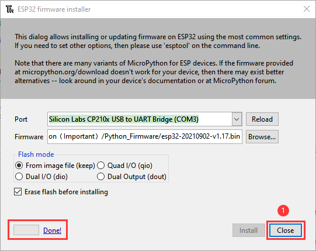

Turn off all windows and turn to the main page and click

Test Code

Test the Shell commander

Input print('hello world') in the“Shell”and press **Enter**

Connect the ESP32 to your PC. Users can program and debug programs with
Thonny.

Open Thonny and click Open.

Then a new window pops up, click“This computer”

Select the file 

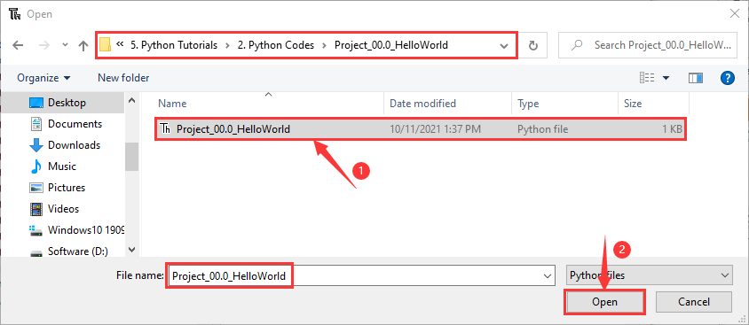

Click 
,“Hello World”will be printed in
the“Shell”monitor

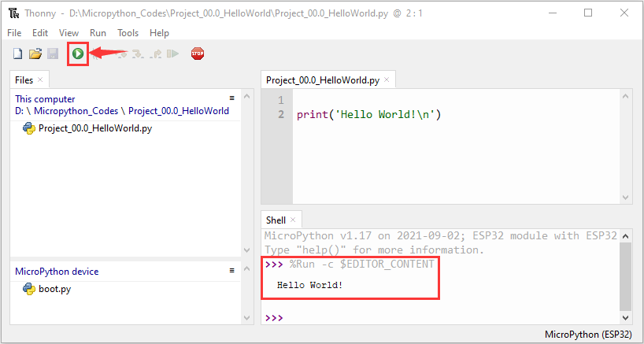

Note: Press the reset button to reboot

Run the test code(offline)

After rebooting the ESP32, run the boot.py file under the root directory
first then run your code file.

So, we need to add a guide program to run the code of users.

KS5002 Keyestudio Beetlebot 3 in1 Robot for ESP32 STEM Education\\Python
Tutorials\\Python Codes/Micropython\_Codes.

Click Project\_00.1\_Boot and double-click boot.py, then the code under
MicroPython device can run offline.

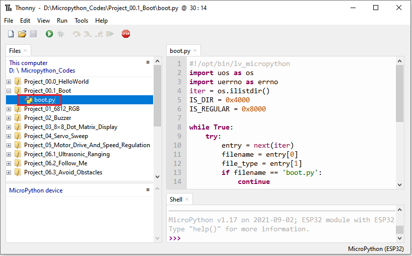

If you want to run the code offline, you nee to upload boot.py and
program code to MicroPython device, then press the ESP32 button. We will
take the Project\_00.0和Project\_00.1 as an example. Select boot.py and
right-click Upload to /.

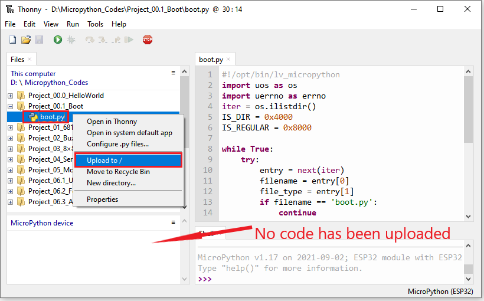

Similarly, upload the Project\_00.0\_HelloWorld.py file to the
“MicroPython device”.

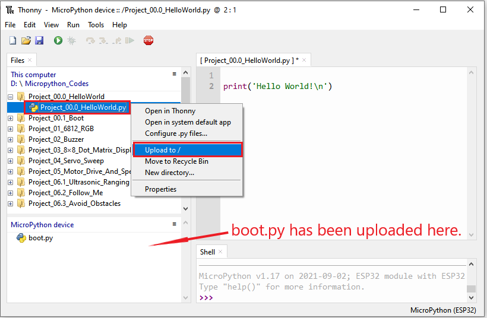

Press the Reset button, you will view code running in the Shell monitor

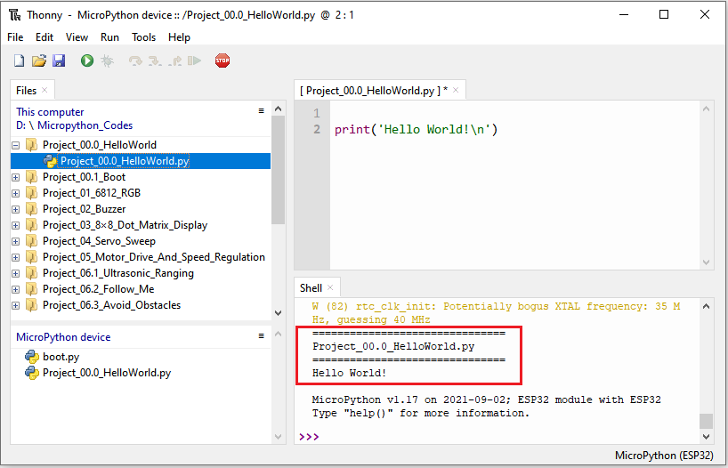

Upload the code to the ESP32

We take the boot.py as an example. If we add a boot.py in each code
directory, reboot the ESP32, the boot.py will run first

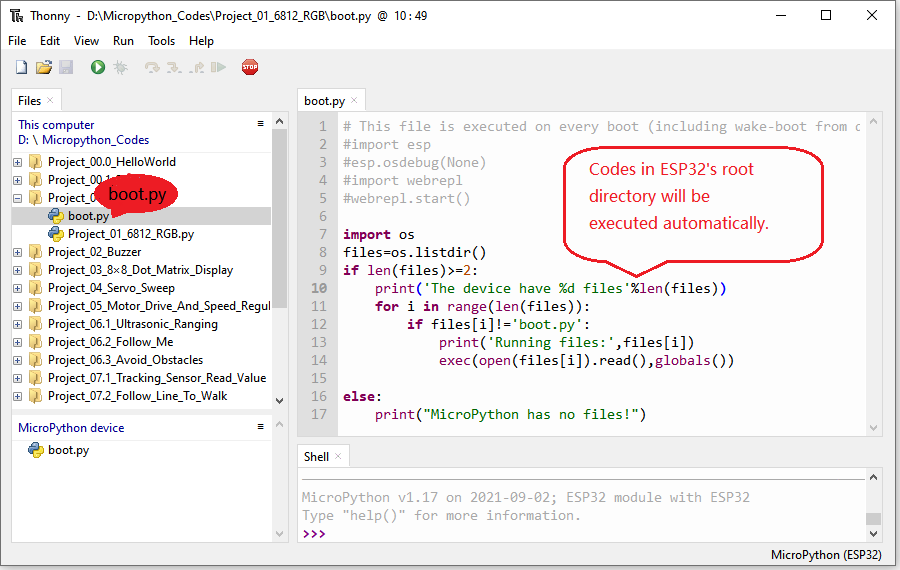

Project\_01\_6812\_RGB&lt;boot.py, right-click to select“Upload to /”.
Then the code will be uploaded to the root directory of the ESP32 and
click OK

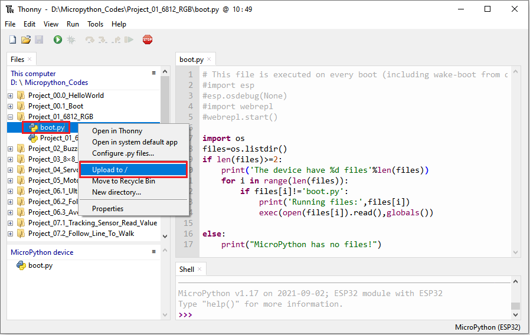

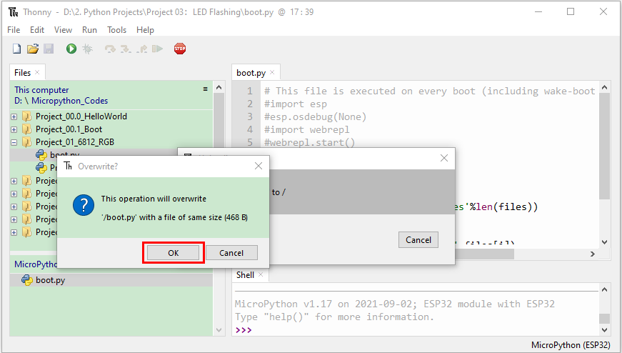

Download the code to your PC:

MicroPython device&lt;boot.py, then right-click Download to…

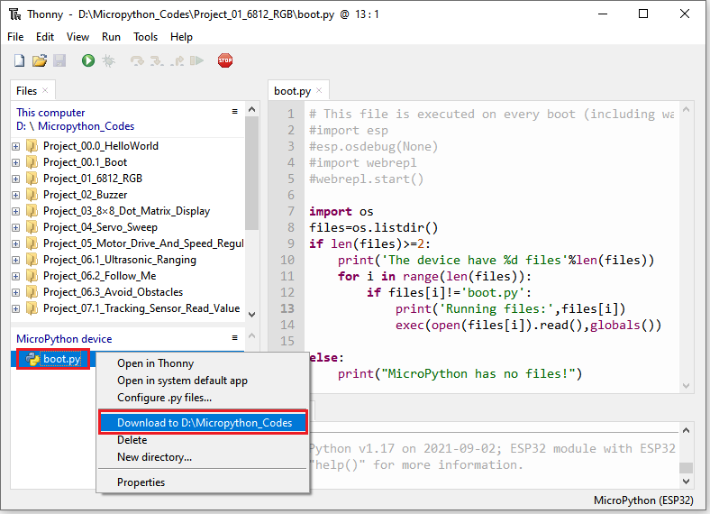

Delete files of the ESP32

For example, click“boot.py”in the MicroPython device and right-click
Delete

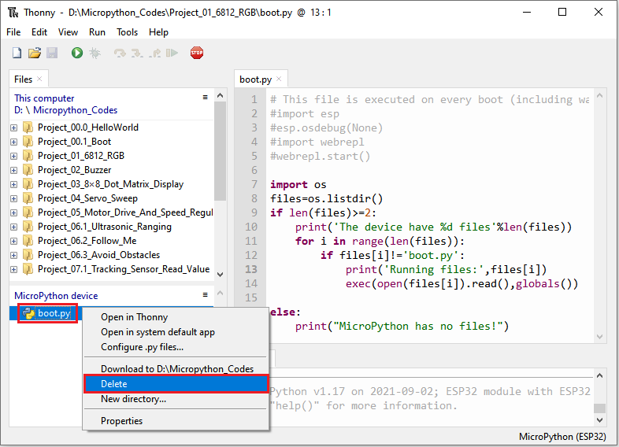

Select boot.py in the Project\_01\_6812\_RGB folder, right-click Move to
Recycle Bin to delete it

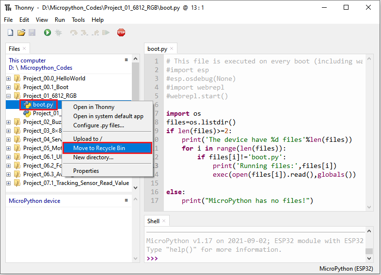

Create and save code

Click“File”→“New”to create and edit code

Enter the code in the new file. We take the Project\_01\_6812\_RGB.py as
an example.

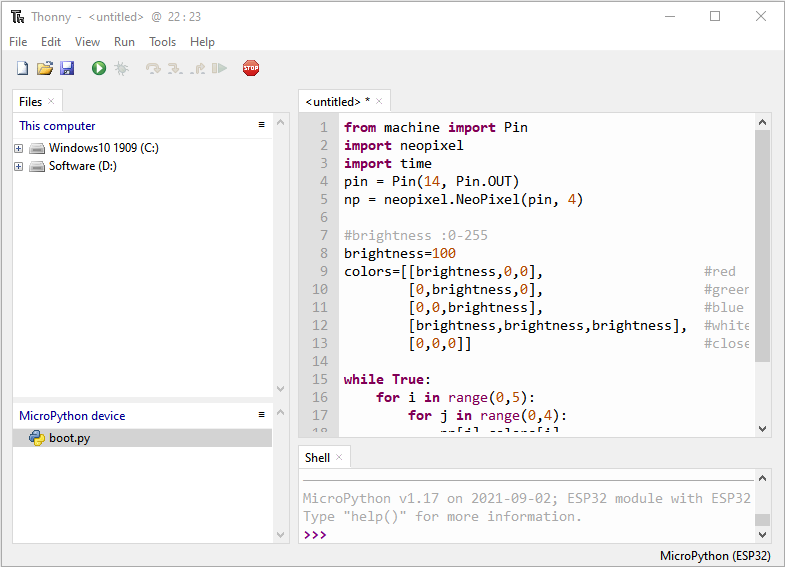

Click 
 to save the code to your PC or the
ESP32.

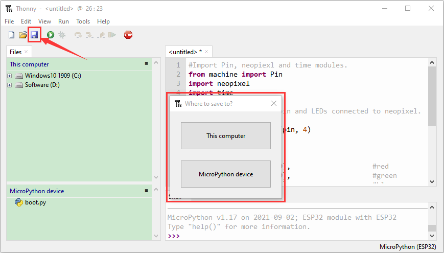

Select MicroPython device and enter main.py in the new page and click
OK.

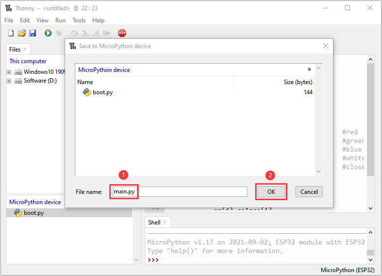

Then the code will be uploaded to the ESP32.

Disconnect the USB cable and reconnect it, you can see that the 4 RGB
LEDs on the PCB board of the car flash red, green, blue and white color,
loop alternately

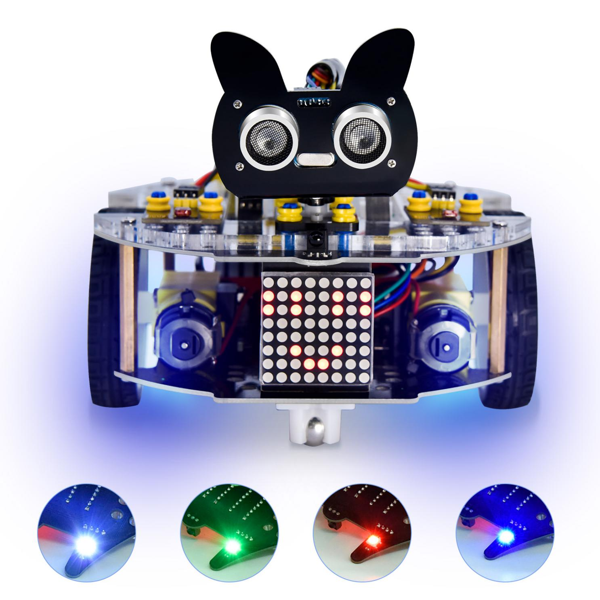

 
