# **Python Tutorials**

## Description：

The Beetlebot smart robot, compatible with LEGO building blocks, is a STEM educational product which can automatically dodge obstacles, follow black lines and light to move. Besides, it has three cool forms such as the soccer robot, the siege robot, the handling robot. As for beginners, they can create whatever
they want by LEGO building blocks.

Various improvements have been made on the Beetlebot car in comparison with other smart cars. It integrates a motor driver and a large number of sensors
and is easy to assemble.

Going forward, not only can it impart Micropython programming knowledge
and AI application to children and the youth, but also it can cultivate
their creativity, hands-on ability, problem-solving capability,
interpersonal communication as well as teamwork ability. With this kit,
you have a chance to experience soccer games using your own robots.

## Features：

  - Compatible with LEGO building blocks: generate diverse forms with
    LEGO blocks and sensors

  - Three forms: a soccer robot, a siege engine, a handling robot

  - Various functions: Pictures display, atmosphere light control, line
    tracking, obstacle avoidance, light following , IR control and WIFI
    control.

  - Easy to build: embedded design on car body; wire up the car body
    with a few steps

  - High compatibility: reserve ports for the Raspberry Pico board and
    the Arduino Nano board

  - Charging function: integrate a circuit for 18650 batteries, low-cost
    and effective

  - WiFi Control: adopt WiFi control, can finish tailor-made software
    development

  - App: compatible with Android and iOS systems, with aesthetic page
    and flexible control system

## 5\. How to install the Beetlebot car：

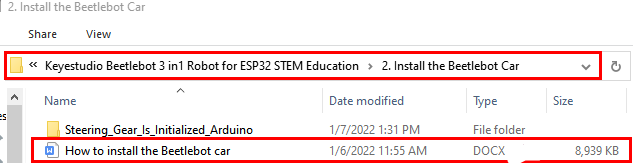

## 6\. PCB Board：

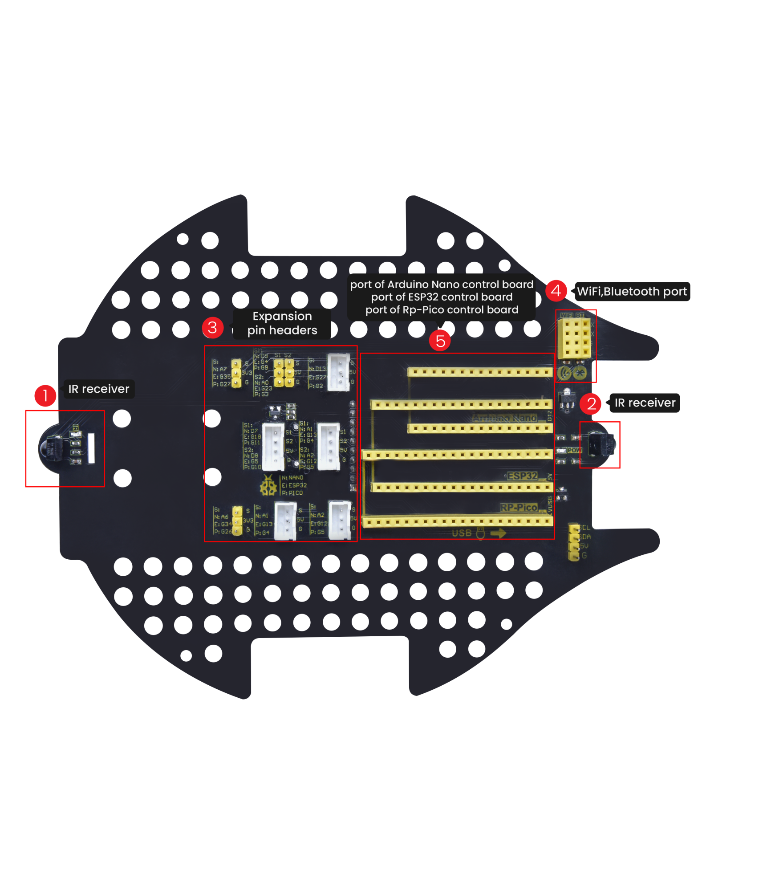

**Turn the DIP switch to the OFF end before installing or removing
batteries**

# **Projects：**

## Project 1: 6812 RGB

1.  **Description：**

There are 4 RGB LEDs can be widely used in the decoration of buildings,
bridges, roads, gardens, courtyards and so on by colors adjustment.

In this experiment, we will demonstrate different lighting effects with
them.

**2. Knowledge：**

**Working Principle**

From the schematic diagram, we can see that these four pixel lighting
beads are all connected in series. In fact, no matter how many they are,
we can use a pin to control a light and let it display any color. The
pixel point contains a data latch signal shaping amplifier drive
circuit, a high-precision internal oscillator and a 12V high-voltage
programmable constant current control part, which effectively ensures
the color of the pixel point light is highly consistent.

The data protocol adopts a single-wire zero-code communication method.
After the pixel is powered up and reset, the S terminal receives the
data transmitted from the controller. The first 24bit data sent is
extracted by the first pixel and sent to the data latch of the pixel.

**3. Test Code：**

The SK6812RGB on the PCB board is controlled by the GPIO 14 of the ESP32
board.

You can download test code from a link
[https://fs.keyestudio.com/KS50](https://fs.keyestudio.com/KS0470)02 You
can save the code anywhere. We save the code in the drive D of our
computer.

As shown below: D:\\Micropython\_Codes.

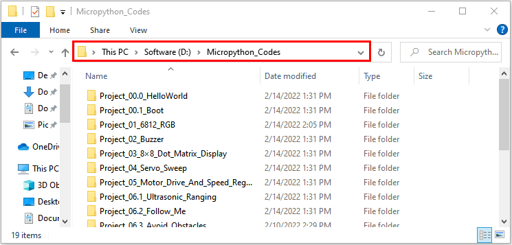

Run the test code：

Open“Thonny”and click“This computer”→“D:”→“Micropython\_Codes”

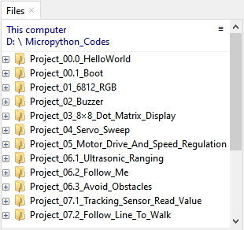

Click Project\_01\_6812\_RGB and double-click Project\_01\_6812\_RGB.py
as shown below:

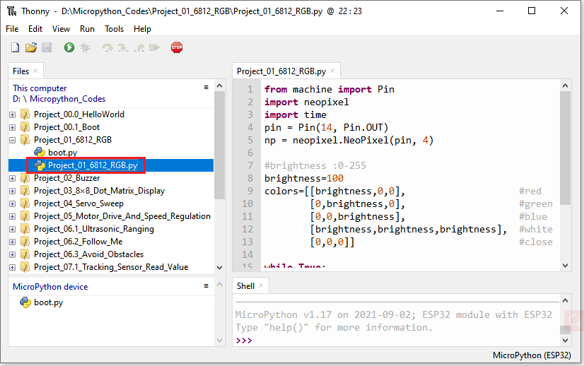

<table>
<tbody>
<tr class="odd">
<td>
#Import Pin, neopiexl and time modules.

from machine import Pin

import neopixel

import time

#Define the number of pin and LEDs connected to neopixel.

pin = Pin(14, Pin.OUT)

np = neopixel.NeoPixel(pin, 4)

#brightness :0-255

brightness=100

colors=[[brightness,0,0], #red

[0,brightness,0], #green

[0,0,brightness], #blue

[brightness,brightness,brightness], #white

[0,0,0]] #close

#Nest two for loops to make the module repeatedly display five states of red, green, blue, white and OFF.

while True:

for i in range(0,5):

for j in range(0,4):

np[j]=colors[i]

np.write()

time.sleep_ms(50)

time.sleep_ms(500)

time.sleep_ms(500)
</td>
</tr>
</tbody>
</table>

Connect the ESP32 board to your PC and click  or
press **Reset**

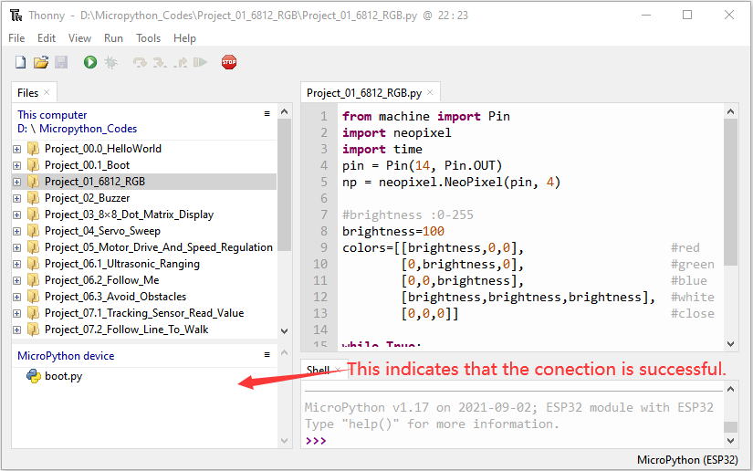

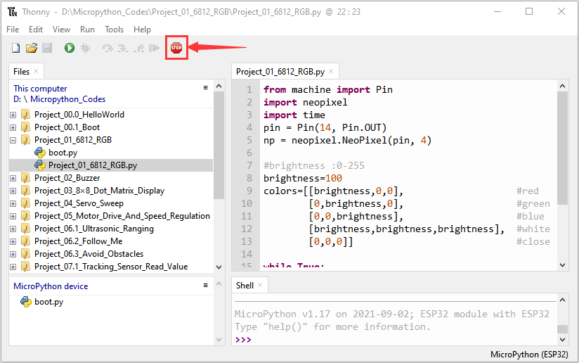

Click “Run current script”, the Shell monitor
will show scripts and code will be run.

4 RGB lights will show red, green, blue and white color then go off,
loop alternately.

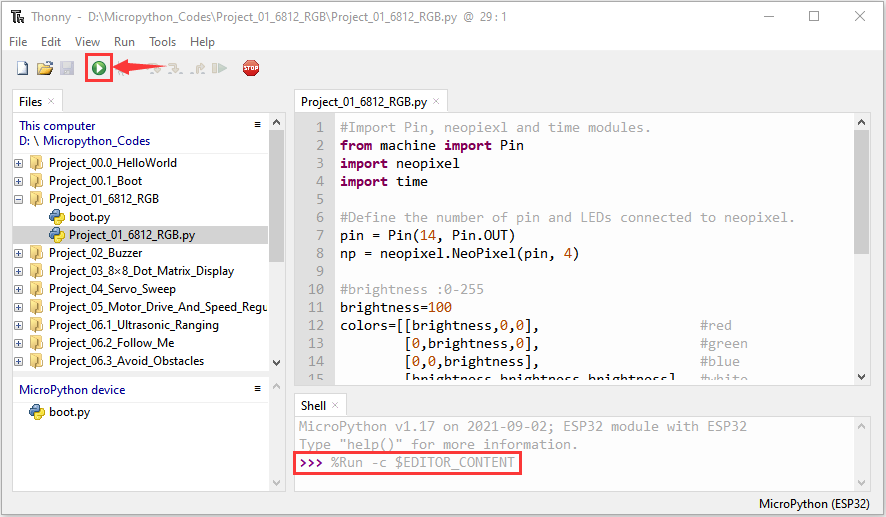

Note：

Unplug the ESP32 board or press Reset, 4个RGB LEDs show the same color
and Thonny shows as follows;

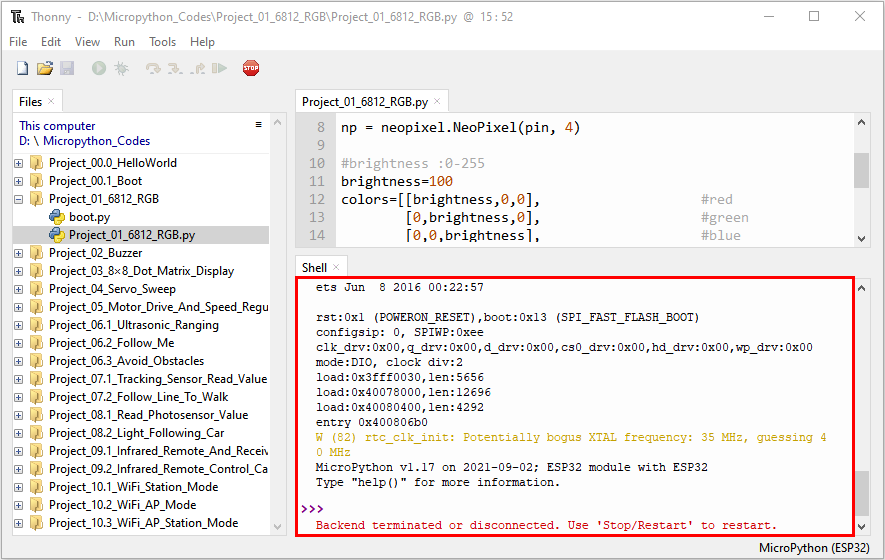

Upload the test code to the ESP32 board.（offline)

Right-click Project\_01\_6812\_RGB.py, select“Upload to /”to upload the
code

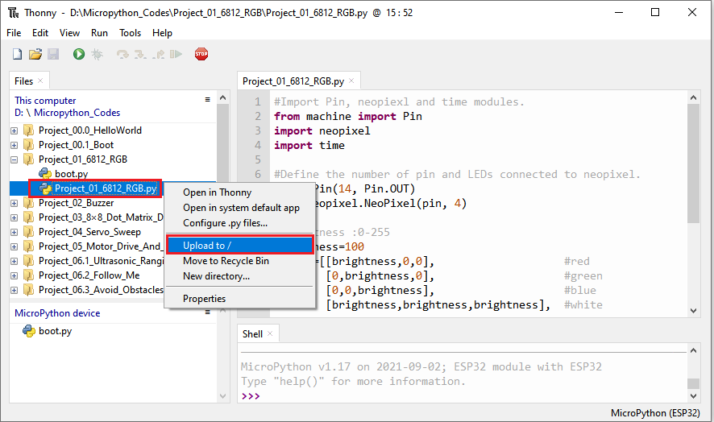

You can upload the boot.py in same way and click“OK”.

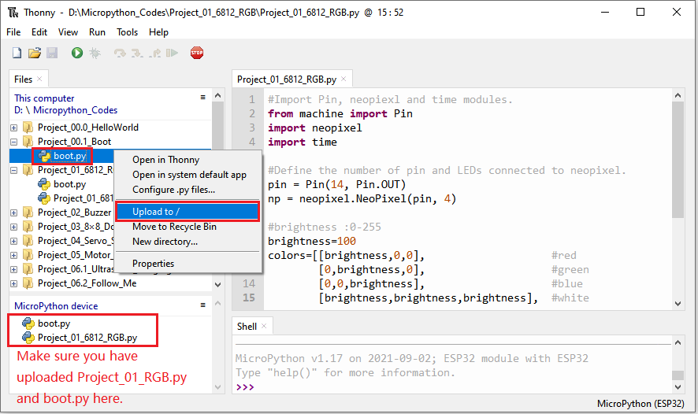

Press the Reset button on the ESP32 board, then the RGB LEDs will will
show red, green, blue and white color then go off, loop alternately

Note：

If you want to stop running code, just click 

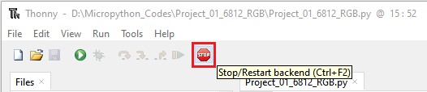

## Project 2: Play Music

1.  **Description：**

There is a power amplifier component on the expansion board, which is
often used to play music and serve as an external amplifying device for
music playback devices.

In this experiment, we use the speaker amplifier component to play
music.

**2. Knowledge：**

Power amplifier modules(equivalent to a passive buzzer) don’t have
internal oscillation circuits.

The power amplifier module can chime sounds with different frequency
when power it up.

**3. Test Code：**

The speaker component on the PCB board is controlled by the GPIO 2 of
the ESP32 board.

You can download test code from a link
[https://fs.keyestudio.com/KS50](https://fs.keyestudio.com/KS0470)02 You
can save the code anywhere. We save the code in the drive D of our
computer.

As shown below: D:\\Micropython\_Codes.

Open“Thonny”and click“This
computer”→“D:”→“Micropython\_Codes”→“Project\_02\_Buzzer”

Double-click Project\_02\_Buzzer.py”as shown below:

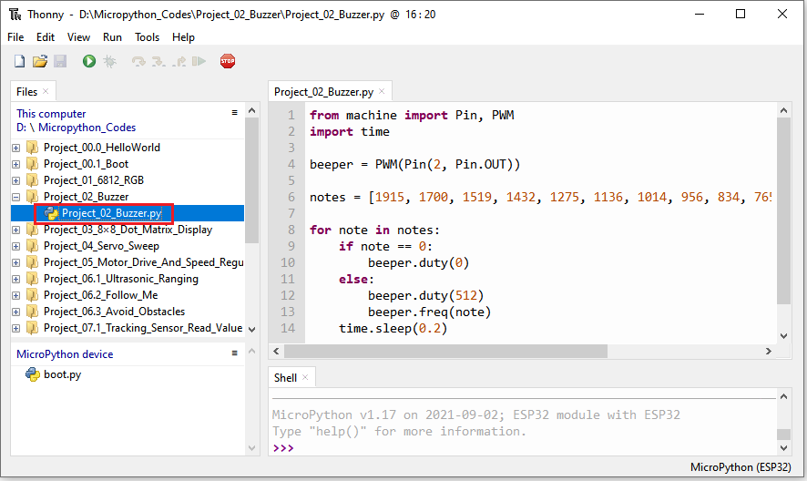

<table>
<tbody>
<tr class="odd">
<td>
from machine import Pin, PWM

import time

beeper = PWM(Pin(2, Pin.OUT))

notes = [1915, 1700, 1519, 1432, 1275, 1136, 1014, 956, 834, 765, 593, 468, 346, 224, 655, 715]

for note in notes:

if note == 0:

beeper.duty(0)

else:

beeper.duty(512)

beeper.freq(note)

time.sleep(0.2)

beeper.duty(0)

time.sleep(0.1)
</td>
</tr>
</tbody>
</table>

Connect the ESP32 board to your PC and click 

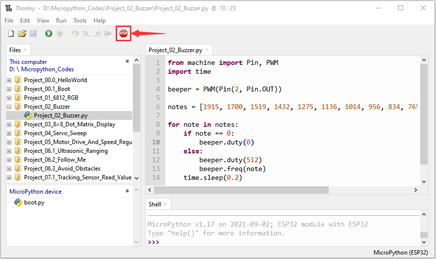

Click , the script starts running, then the
speaker module on the PCB will emit sounds; press“Ctrl+C”or click
 to exit

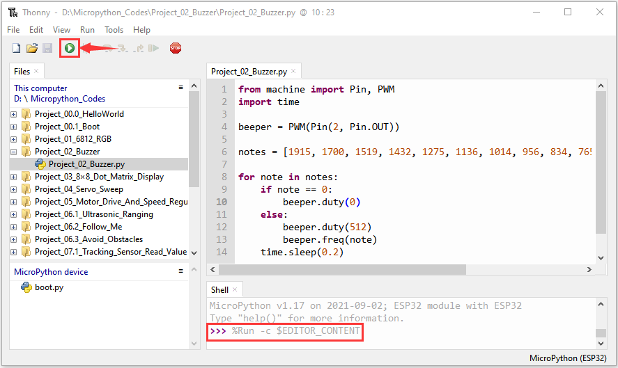

## Project 3: 8\*8 Dot Matrix Display

1.  **Description：**
    
    Composed of LED emitting tube diodes, the 8\*8 LED dot matrix are
    applied widely to public information display like advertisement
    screen and bulletin board, by controlling LED to show words,
    pictures and videos, etc.
    
    **2. Knowledge：**

There are different types of matrices, including 4×4, 8×8 and 16×16 and
etc. It contains 64 LEDs.

The inner structure of 8×8 dot matrix is shown below.

Every LED is installed on the cross point of row line and column line.
When the voltage on a row line increases, and the voltage on the column
line reduces, the LED on the cross point will light up. 8×8 dot matrix
has 16 pins. Put the silk-screened side down and the numbers are 1, 8, 9
and 16 in anticlockwise order as marked below.

The definition inner pins are shown below:

For instance, to light up the LED on row 1 and column 1, you should
increase the voltage of pin 9 and reduce the voltage of pin 13.

**HT16K33 8X8 Dot Matrix**

The HT16K33 is a memory mapping and multi-purpose LED controller driver.
The max. Display segment numbers in the device is 128 patterns (16
segments and 8 commons) with a 13\*3 (MAX.) matrix key scan circuit. The
software configuration features of the HT16K33 makes it suitable for
multiple LED applications including LED modules and display subsystems.
The HT16K33 is compatible with most microcontrollers and communicates
via a two-line bidirectional I2C-bus.

The picture below is the working schematic of HT16K33 chip

We design the drive module of 8\*8 dot matrix based on the above
principle. We could control the dot matrix by I2C communication and two
pins of microcontroller, according to the above diagram.

**3. Specification:**

  - Input voltage: 5V    

  - Rated input frequency: 400KHZ 

  - Input power: 2.5W  

  - Input current: 500mA  
    
    **4. Introduction for Modulus Tool**

The online version of dot matrix modulus tool:

[http://dotmatrixtool.com/\#](http://dotmatrixtool.com/)

①Open the link to enter the following page.

②The dot matrix is 8\*8 in this project. So set the height to 8, width
to 8; as shown below.

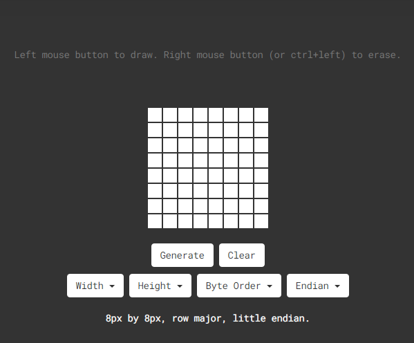

**③**Click **Byte Order** to select **Row Major**

Click **Endian** to select **Big Endian**(MSB)

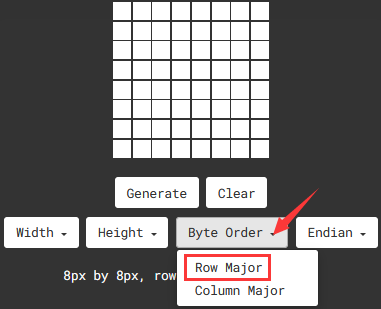

③ Generate hexadecimal data from the pattern

As shown below, the left button of the mouse is for selection while the
right is for canceling. Thus you could use them to draw the pattern you
want, then click **Generate**, to yield the hexadecimal data needed.

The generated hexadecimal code（0x00, 0x66, 0x00, 0x00, 0x18, 0x42, 0x3c,
0x00) is what will be displayed, so you need to save it for next
procedure.

**2. Wiring up：**

<table>
<tbody>
<tr class="odd">
<td>8*8 Dot matrix display</td>
<td>PCB Board</td>
</tr>
<tr class="even">
<td>G</td>
<td>G</td>
</tr>
<tr class="odd">
<td>5V</td>
<td>5V</td>
</tr>
<tr class="even">
<td>SDA</td>
<td>SDA</td>
</tr>
<tr class="odd">
<td>SCL</td>
<td>SCL</td>
</tr>
</tbody>
</table>

**3. Test Code：**

The 8\*8 dot matrix is controlled by GPIO21（SDA）and GPIO22（SCL）of the
ESP32 board.

You can download test code from a link
[https://fs.keyestudio.com/KS50](https://fs.keyestudio.com/KS0470)02 You
can save the code anywhere. We save the code in the drive D of our
computer.

As shown below: D:\\Micropython\_Codes.

Open“Thonny”and click“This
computer”→“D:”→“Micropython\_Codes”→“Project\_03\_8×8\_Dot\_Matrix\_Display”;
select“ht16k33.py” and“ht16k33matrix.py”and right-click“Upload to /”;
wait“ht16k33.py”and“ht16k33matrix.py”uploaded to the ESP32 board. Then
double-click

Click Project\_01\_6812\_RGB and double-click Project\_01\_6812\_RGB.py
as shown below:“Project\_03\_8×8\_Dot\_Matrix\_Display.py”

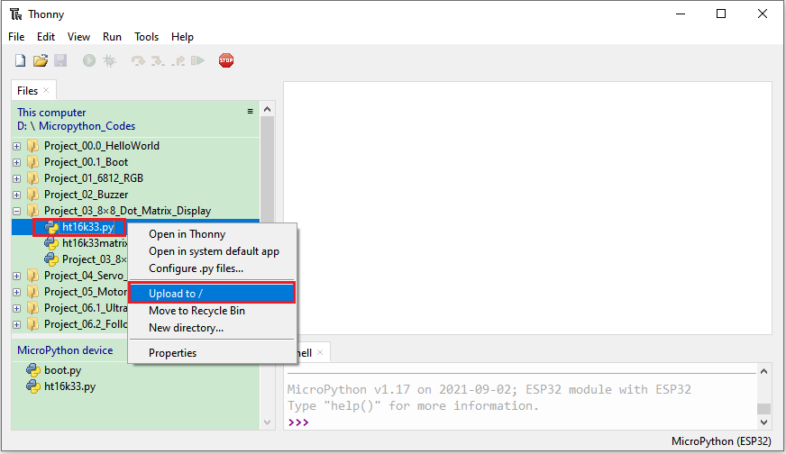

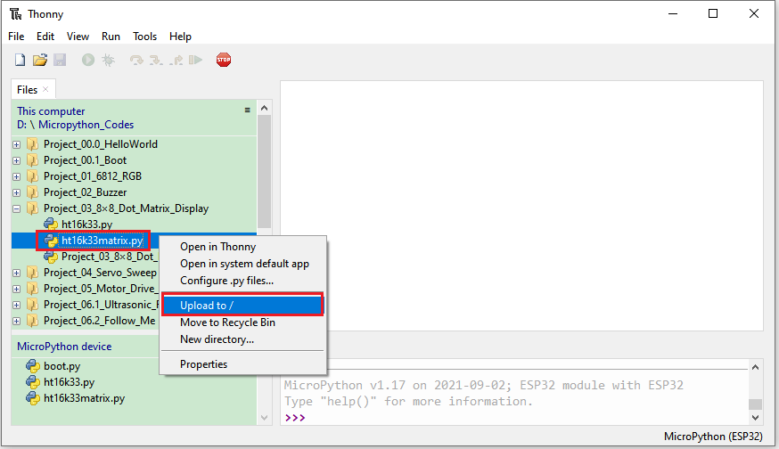

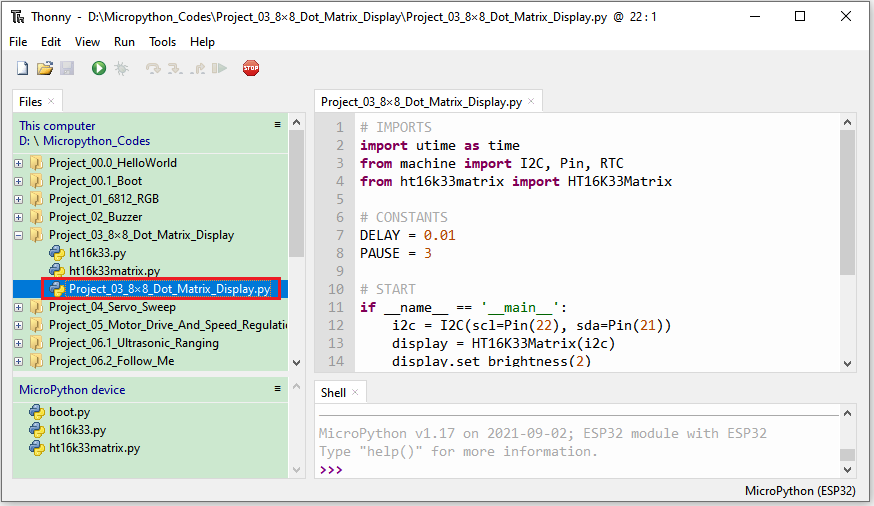

<table>
<tbody>
<tr class="odd">
<td>
# IMPORTS

import utime as time

from machine import I2C, Pin, RTC

from ht16k33matrix import HT16K33Matrix

# CONSTANTS

DELAY = 0.01

PAUSE = 3

# START

if __name__ == '__main__':

i2c = I2C(scl=Pin(22), sda=Pin(21))

display = HT16K33Matrix(i2c)

display.set_brightness(2)

# Draw a custom icon on the LED

icon = b"\x00\x66\x00\x00\x18\x42\x3c\x00"

display.set_icon(icon).draw()

# Rotate the icon

display.set_angle(0).draw()

time.sleep(PAUSE)
</td>
</tr>
</tbody>
</table>

Note: the code 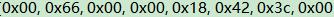 changes into the code.

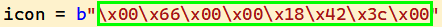

**Test Result**

Connect the ESP32 board to your PC and clock or
press **Reset**

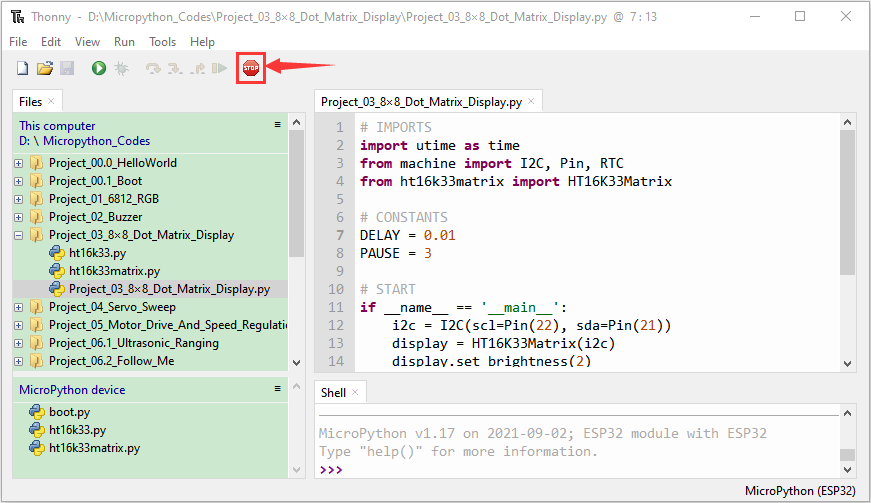

Click , the script starts running, then the 8\*8
module will show a smile pattern. Press“Ctrl+C”or click
 to exit

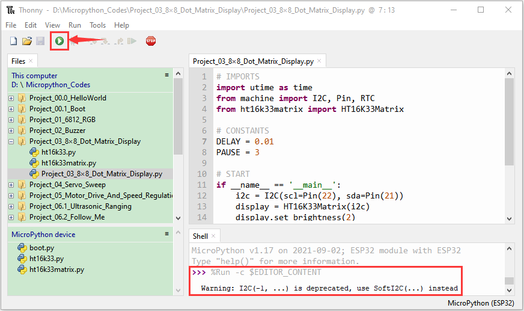

## Project 4: Servo Rotation

1.  **Description：**

There are two servos on the car. We take the servo connected to pin D9
as an example.

The servo is a motor that can rotate very accurately. It has been widely
applied to toy cars, remote control helicopters, airplanes, robots and
other fields. In this project, we will use the Nano motherboard to
control the servo to spin.

2.  **Knowledge：**

Servo motor is a position control rotary actuator. It mainly consists of
a housing, a circuit board, a core-less motor, a gear and a position
sensor. Its working principle is that the servo receives the signal sent
by MCU or receiver and produces a reference signal with a period of 20ms
and width of 1.5ms, then compares the acquired DC bias voltage to the
voltage of the potentiometer and obtain the voltage difference output.

When the motor speed is constant, the potentiometer is driven to rotate
through the cascade reduction gear, which leads that the voltage
difference is 0, and the motor stops rotating. Generally, the angle
range of servo rotation is 0° --180 °

The rotation angle of servo motor is controlled by regulating the duty
cycle of PWM (Pulse-Width Modulation) signal. The standard cycle of PWM
signal is 20ms (50Hz). Theoretically, the width is distributed
between 1ms-2ms, but in fact, it's between 0.5ms-2.5ms. The width
corresponds the rotation angle from 0° to 180°. But note that for
different brand motors, the same signal may have different rotation
angles. 

In general, servo has three lines in brown, red and orange. The brown
wire is grounded, the red one is a positive pole line and the orange one
is a signal line.

3.  **Wire up：**

<table>
<tbody>
<tr class="odd">
<td>Servo</td>
<td>PCB Board</td>
</tr>
<tr class="even">
<td>Brown</td>
<td>G</td>
</tr>
<tr class="odd">
<td>Red</td>
<td>5V</td>
</tr>
<tr class="even">
<td>Orange</td>
<td>S1（GPIO4）</td>
</tr>
</tbody>
</table>

4.  **Test Code：**

The servo for controlling the ultrasonic sensor is controlled by the
GPIO4 of the ESP32 board.

You can download test code from a link
[https://fs.keyestudio.com/KS50](https://fs.keyestudio.com/KS0470)02 You
can save the code anywhere. We save the code in the drive D of our
computer.

As shown below: D:\\Micropython\_Codes.

Open“Thonny”and click“This
computer”→“D:”→“Micropython\_Codes”→“Project\_04\_Servo\_Sweep”

Select myservo.py, right-click Upload to/ to upload myservo.py to the
ESP32;

Double-click“Project\_04\_Servo\_Sweep.py”as shown below:

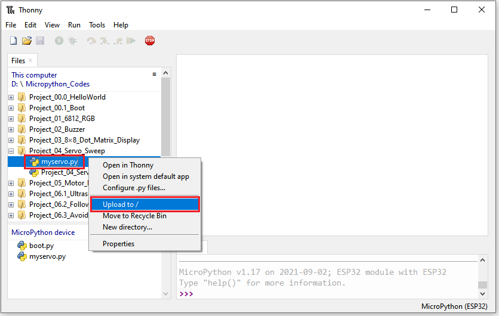

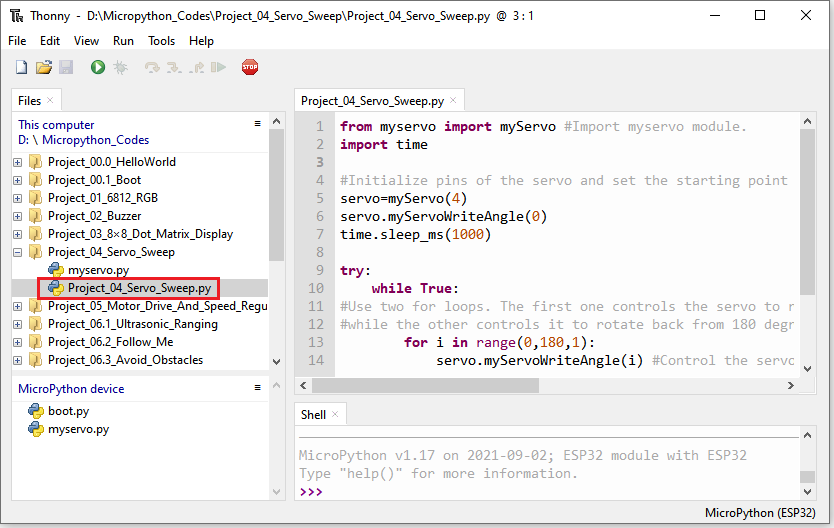

<table>
<tbody>
<tr class="odd">
<td>
from myservo import myServo #Import myservo module.

import time

#Initialize pins of the servo and set the starting point of the servo to 0 degree.

servo=myServo(4)

servo.myServoWriteAngle(0)

time.sleep_ms(1000)

try:

while True:

#Use two for loops. The first one controls the servo to rotate from 0 degree to 180 degrees

#while the other controls it to rotate back from 180 degrees to 0 degree.

for i in range(0,180,1):

servo.myServoWriteAngle(i) #Control the servo to rotate to a specified angle within the range of 0-180 degrees.

time.sleep_ms(15)

for i in range(180,0,-1):

servo.myServoWriteAngle(i)

time.sleep_ms(15)

except:

servo.deinit()
</td>
</tr>
</tbody>
</table>

**Test Result**

Connect the ESP32 board to your PC and click 

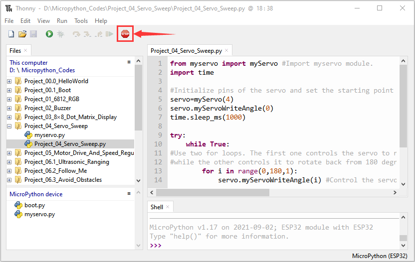

Place batteries in the battery holder, turn the power switch to ON end
and power up.

Click , the script starts running, then the servo
rotate from 0° to 180°, then from 180° to 0°, loop alternately.

Press“Ctrl+C”or click  to exit.

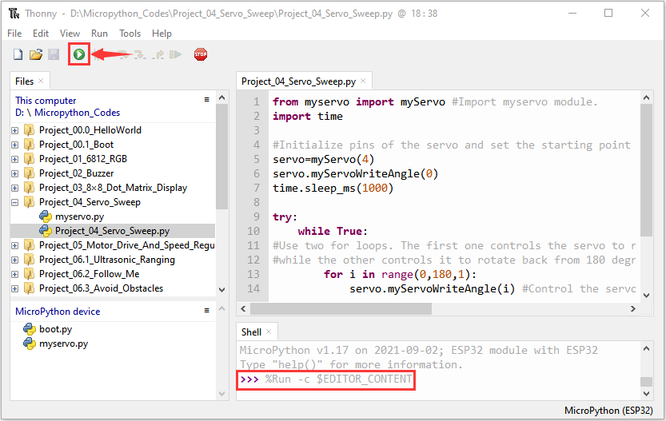

## Project 5: Motor Driving and Speed Control 

1.  **Description：**

There are many ways to drive motors. This car uses the most commonly
used DRV8833 motor driver chip, which provides a dual-channel bridge
electric driver for toys, printers and other motor integration
applications.

In this experiment, we use the DRV8833 motor driver chip on the
expansion board to drive the two DC motors, and demonstrate the effect
of forward, backward, left-turning, and right-turning.

**2. Knowledge：**

DRV8833 motor driver chip: Dual H-bridge motor driver with current
control function, can drive two DC motors, one bipolar stepper motor,
solenoid valve or other inductive loads. Each H-bridge includes
circuitry to regulate or limit winding current.

An internal shutdown function with a fault output pin is used for
over-current and short circuit protection, under-voltage lockout and
over-temperature. A low-power sleep mode is also added. Let's take a
look at the schematic diagram of the DRV8833 motor driver chip driving
two DC motors:

If you want to get insight to it, you can check the specification of
this chip. Just browse it in the“Attachments”folder.

**3. Specification：**

Input voltage of logic part: DC 5V

Input voltage of driving part : DC 5V

Working current of logic part: \<30mA

Operating current of driving part: \<2A

Maximum power dissipation: 10W (T=80℃)

Motor speed: 5V 200 rpm / min

Motor drive form: dual H-bridge drive

Control signal input level: high level 2.3V\<Vin\<5V, low level
-0.3V\<Vin\<1.5V

Working temperature: -25\~130℃

**4. Drive the car to move**

From the above diagram, the direction pin of the left motor is GPIO33;
the speed pin is GPIO26; GPIO32 is the direction pin of the right motor;
and GPIO25 is speed pin.

PWM drives the robot car. The PWM value is in the range of 0-255. The
more the PWM value is set, the faster the rotation of the motor.

<table>
<tbody>
<tr class="odd">
<td>Function</td>
<td>GPIO33</td>
<td>GPIO26（PWM)</td>
<td>Left motor</td>
<td>GPIO32</td>
<td>GPIO25（PWM)</td>
<td>Right motor</td>
</tr>
<tr class="even">
<td>forward</td>
<td>LOW</td>
<td>200</td>
<td>clockwise</td>
<td>LOW</td>
<td>200</td>
<td>clockwise</td>
</tr>
<tr class="odd">
<td>Go back</td>
<td>HIGH</td>
<td>50</td>
<td>anticlockwise</td>
<td>HIGH</td>
<td>50</td>
<td>anticlockwise</td>
</tr>
<tr class="even">
<td>Turn left</td>
<td>HIGH</td>
<td>200</td>
<td>anticlockwise</td>
<td>LOW</td>
<td>200</td>
<td>clockwise</td>
</tr>
<tr class="odd">
<td>Turn right</td>
<td>LOW</td>
<td>200</td>
<td>clockwise</td>
<td>HIGH</td>
<td>200</td>
<td>anticlockwise</td>
</tr>
<tr class="even">
<td>Stop</td>
<td>LOW</td>
<td>0</td>
<td>stop</td>
<td>LOW</td>
<td>0</td>
<td>stop</td>
</tr>
</tbody>
</table>

You can download test code from a link
[https://fs.keyestudio.com/KS50](https://fs.keyestudio.com/KS0470)02 You
can save the code anywhere. We save the code in the drive D of our
computer.

As shown below: D:\\Micropython\_Codes.

Open“Thonny”and click“This
computer”→“D:”→“Micropython\_Codes”→“Project\_05\_Motor\_Drive\_And\_Speed\_Regulation”;

Click Project\_05\_Motor\_Drive\_And\_Speed\_Regulation.py as shown
below:

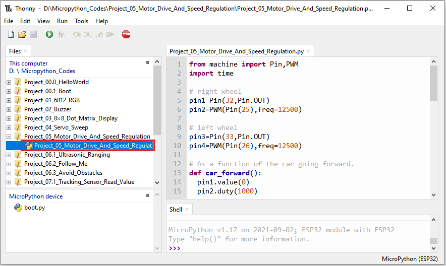

<table>
<tbody>
<tr class="odd">
<td>
from machine import Pin,PWM

import time

# right wheel

pin1=Pin(32,Pin.OUT)

pin2=PWM(Pin(25),freq=12500)

# left wheel

pin3=Pin(33,Pin.OUT)

pin4=PWM(Pin(26),freq=12500)

# As a function of the car going forward.

def car_forward():

pin1.value(0)

pin2.duty(1000)

pin3.value(0)

pin4.duty(1000)

# As a function of the car going backwards.

def car_back():

pin1.value(1)

pin2.duty(250)

pin3.value(1)

pin4.duty(250)

# As a function of the car going left.

def car_left():

pin1.value(0)

pin2.duty(1000)

pin3.value(1)

pin4.duty(500)

# As a function of the car going right.

def car_right():

pin1.value(1)

pin2.duty(500)

pin3.value(0)

pin4.duty(1000)

# As a function of the car stopping.

def car_stop():

pin1.value(0)

pin2.duty(0)

pin3.value(0)

pin4.duty(0)

try:

while True:

car_forward() #Car ahead

time.sleep(2) # delay 2s

car_back() # Car goes back

time.sleep(2)

car_left() # Car to the left

time.sleep(2)

car_right() # Car to the right

time.sleep(2)

car_stop() # Car stop

time.sleep(2)

except:

pass
</td>
</tr>
</tbody>
</table>

**6.Test Result**

Connect the ESP32 board to your PC and click 

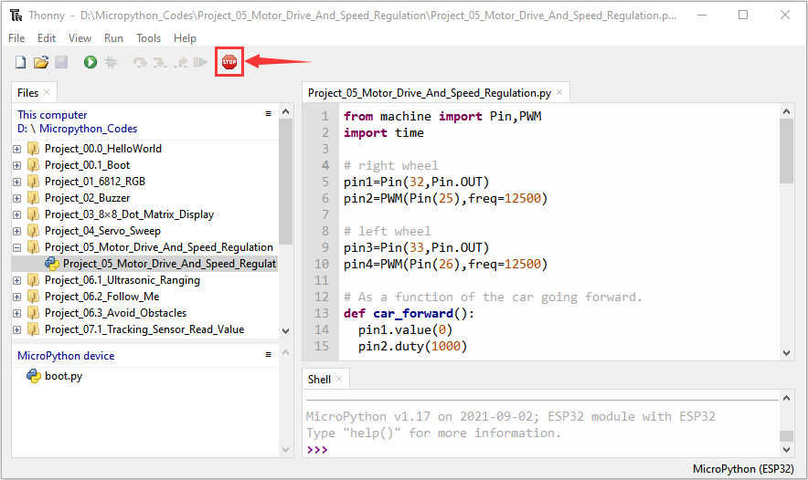

Place batteries, turn the power switch to ON end and power up. Click
, the script starts running, the car will move
forward for 2s, back for 2s, turn left for 2s, right for 2s and stops
for 2s, loop alternately.

Press“Ctrl+C”or click  to exit

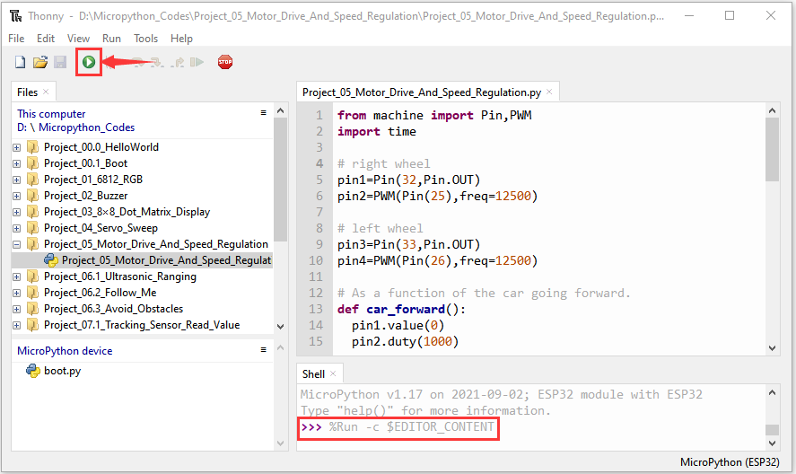

## Project 6: Ultrasonic Sensor

There is an ultrasonic sensor on the car. It is a very affordable
distance-measuring sensor.

The ultrasonic sensor sends a high-frequency ultrasonic signal that
human hearing can’t hear. When encountering obstacles, these signals
will be reflected back immediately. After receiving the returned
information, the distance between the sensor and the obstacle will be
calculated by judging the time difference between the transmitted signal
and the received signal. It is mainly used for object avoidance and
ranging in various robotics projects.

### Project 6.1: Ultrasonic Ranging

**1.Description：**

In this experiment, we use an ultrasonic sensor to measure distance and
print the data on a serial monitor.

**2. Knowledge：**

The HC-SR04 ultrasonic sensor uses sonar to determine distance to an
object like what bats do. It offers excellent non-contact range
detection with high accuracy and stable readings in an easy-to-use
package. It comes complete with ultrasonic transmitter and receiver
modules.

The HC-SR04 or the ultrasonic sensor is being used in a wide range of
electronics projects for creating obstacle detection and distance
measuring application as well as various other applications. Here we
have brought the simple method to measure the distance with Arduino and
ultrasonic sensor and how to use ultrasonic sensor with Arduino.

**Use method and timing chart of ultrasonic module:**

1.  Setting the delay time of Trig pin of SR04 to 10μs at least, which
    can trigger it to detect distance.

2.  After triggering, the module will automatically send eight 40KHz
    ultrasonic pulses and detect whether there is a signal return. This
    step will be completed automatically by the module.

3.  If the signal returns, the Echo pin will output a high level, and
    the duration of the high level is the time from the transmission of
    the ultrasonic wave to the return.

Time=Echo pulse width, unit: us

Distance（cm）=time/ 58

Distance(inch)=time/ 148

The HC-SR04 ultrasonic sensor has four pins: Vcc, Trig, Echo and GND.

The Vcc pin provides power generating ultrasonic pulses and is connected
to Vcc/+5V. The GND pin is grounded/GND.

The Trig pin is where the Arduino sends a signal to start the ultrasonic
pulse. The Echo pin is where the ultrasonic sensor sends information
about the duration of the ultrasonic pulse stroke to the Arduino control
board.

**Wiring Up**

<table>
<tbody>
<tr class="odd">
<td>Ultrasonic Sensor</td>
<td>PCB Board</td>
</tr>
<tr class="even">
<td>Vcc</td>
<td>5V</td>
</tr>
<tr class="odd">
<td>Trig</td>
<td>S2（GPIO5）</td>
</tr>
<tr class="even">
<td>Echo</td>
<td>S1（GPIO18）</td>
</tr>
<tr class="odd">
<td>Gnd</td>
<td>G</td>
</tr>
</tbody>
</table>

**3. Test Code：**

The pin Trig and Echo of the ultrasonic sensor are controlled by the
GPIO5 and GPIO18 of the ESP32 board.

You can download test code from a link
[https://fs.keyestudio.com/KS50](https://fs.keyestudio.com/KS0470)02 You
can save the code anywhere. We save the code in the drive D of our
computer.

As shown below: D:\\Micropython\_Codes.

Open“Thonny”and click This computer → D: →
Micropython\_Codes→“Project\_06.1\_Ultrasonic\_Ranging”

Then double-click Project\_06.1\_Ultrasonic\_Ranging.py

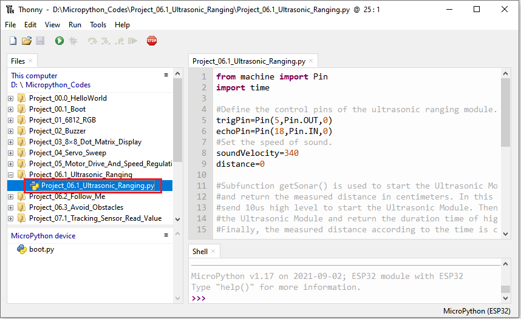

<table>
<tbody>
<tr class="odd">
<td>
from machine import Pin

import time

#Define the control pins of the ultrasonic ranging module.

trigPin=Pin(5,Pin.OUT,0)

echoPin=Pin(18,Pin.IN,0)

#Set the speed of sound.

soundVelocity=340

distance=0

#Subfunction getSonar() is used to start the Ultrasonic Module to begin measurements,

#and return the measured distance in centimeters. In this function, first let trigPin

#send 10us high level to start the Ultrasonic Module. Then use pulseIn() to read

#the Ultrasonic Module and return the duration time of high level.

#Finally, the measured distance according to the time is calculated.

def getSonar():

trigPin.value(1)

time.sleep_us(10)

trigPin.value(0)

while not echoPin.value():

pass

pingStart=time.ticks_us()

while echoPin.value():

pass

pingStop=time.ticks_us()

pingTime=time.ticks_diff(pingStop,pingStart)

distance=pingTime*soundVelocity//2//10000

return int(distance)

#Delay for 2 seconds and wait for the ultrasonic module to stabilize,

#Print data obtained from ultrasonic module every 500 milliseconds.

time.sleep_ms(2000)

while True:

time.sleep_ms(500)

print('Distance: ',getSonar(),'cm' )
</td>
</tr>
</tbody>
</table>

**Test Result**

Connect the ESP32 board to your PC and click 

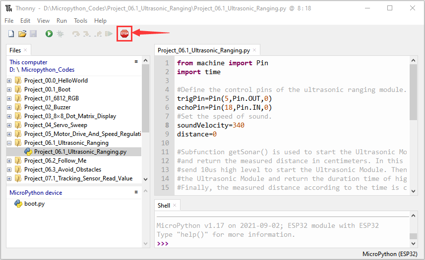

Click , the script starts running, then the shell
monitor will print distance value between the ultrasonic sensor and the
object; press“Ctrl+C”or click  to exit.

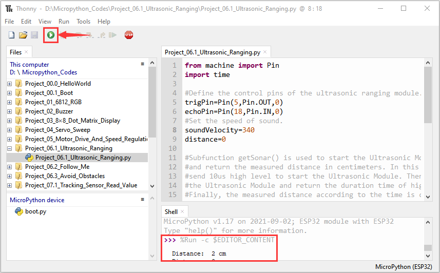

### Project 6.2: Light Following

**1.Description：**

In the above experiments, we have learned about the 8\*8 dot matrix,
motor drivers and speed regulation, ultrasonic sensors, servos and other
hardware. In this experiment, we will combine them to create a follow
car with the ultrasonic sensor. The can can follow an object to move
through

measuring distance.

**2. Working Principle：**

<table>
<tbody>
<tr class="odd">
<td>Detection</td>
<td>Detect the front distance</td>
<td>Distance（unit：cm）</td>
</tr>
<tr class="even">
<td>Condition 1</td>
<td>Distance＜8</td>
<td></td>
</tr>
<tr class="odd">
<td>State</td>
<td>Go back（set PWM to 100）</td>
<td></td>
</tr>
<tr class="even">
<td>Condition 2</td>
<td>8≤distance&lt;13</td>
<td></td>
</tr>
<tr class="odd">
<td>State</td>
<td>stop</td>
<td></td>
</tr>
<tr class="even">
<td>Condition 3</td>
<td>13≤distance&lt;35</td>
<td></td>
</tr>
<tr class="odd">
<td>State</td>
<td>Go forward（set PWM to 200）</td>
<td></td>
</tr>
<tr class="even">
<td>Condition 4</td>
<td>distance≥35</td>
<td></td>
</tr>
<tr class="odd">
<td>State</td>
<td>stop</td>
<td></td>
</tr>
</tbody>
</table>

**3. Flow Chart：**

**4. Test Code：**

You can download test code from a link
[https://fs.keyestudio.com/KS50](https://fs.keyestudio.com/KS0470)02 You
can save the code anywhere. We save the code in the drive D of our
computer.

As shown below: D:\\Micropython\_Codes.

Open“Thonny”and click “This
computer”→“D:”→→“Micropython\_Codes”→“Project\_06.2\_Follow\_Me”，

Double-click“Project\_06.2\_Follow\_Me.py”as shown below:

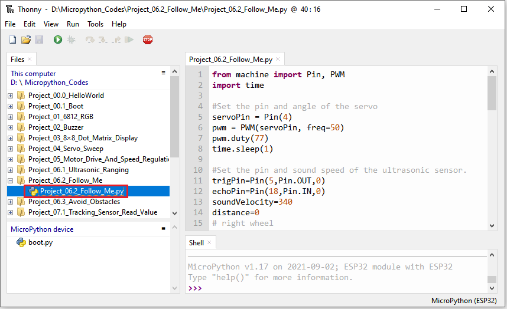

<table>
<tbody>
<tr class="odd">
<td>
from machine import Pin, PWM

import time

#Define GPIO4’s output frequency as 50Hz and its duty cycle as 77, and assign them to PWM

servoPin = Pin(4)

pwm = PWM(servoPin, freq=50)

pwm.duty(77)

time.sleep(1)

#Set the pin and sound speed of the ultrasonic sensor

trigPin=Pin(5,Pin.OUT,0)

echoPin=Pin(18,Pin.IN,0)

soundVelocity=340

distance=0

# right wheel

pin1=Pin(32,Pin.OUT)

pin2=PWM(Pin(25),freq=50,duty=0)

# left wheel

pin3=Pin(33,Pin.OUT)

pin4=PWM(Pin(26),freq=50,duty=0)

# As a function of the car going forward.

def car_forward():

pin1.value(0)

pin2.duty(800)

pin3.value(0)

pin4.duty(800)

# As a function of the car going backwards.

def car_back():

pin1.value(1)

pin2.duty(550)

pin3.value(1)

pin4.duty(550)

# As a function of the car stopping.

def car_stop():

pin2.deinit()

pin4.deinit()

pin1.value(0)

pin2.duty(0)

pin3.value(0)

pin4.duty(0)

#Subfunction getSonar() is used to start the Ultrasonic Module to begin measurements,

#and return the measured distance in centimeters. In this function, first let trigPin

#send 10us high level to start the Ultrasonic Module. Then use pulseIn() to read

#the Ultrasonic Module and return the duration time of high level.

#Finally, the measured distance according to the time is calculated.

def getSonar():

trigPin.value(1)

time.sleep_us(10)

trigPin.value(0)

while not echoPin.value():

pass

pingStart=time.ticks_us()

while echoPin.value():

pass

pingStop=time.ticks_us()

pingTime=time.ticks_diff(pingStop,pingStart)

distance=pingTime*soundVelocity//2//10000

time.sleep_ms(10)

return int(distance)

while True:

Distance=getSonar() #Get the distance measured by ultrasound.

print(Distance) #Send a pulse to calculate the distance in centimeters and print the result.

if Distance&lt;8: #If the distance is less than 8

pin2=PWM(Pin(25),freq=50)

pin4=PWM(Pin(26),freq=50)

car_back() #Car goes back

elif Distance&gt;=8 and Distance&lt;13: #If the distance is greater than or equal to 8, it's less than 13.

car_stop() # Car stop

elif Distance&gt;=13 and Distance&lt;35: #If the distance is greater than or equal to 13, it's less than 35.

pin2=PWM(Pin(25),freq=50)

pin4=PWM(Pin(26),freq=50)

car_forward() #Car ahead

else:

car_stop()
</td>
</tr>
</tbody>
</table>

**5.Test Result**

Connect the ESP32 board to your PC and click 

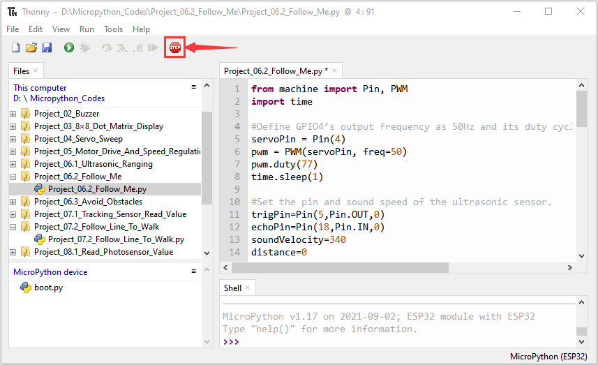

Place batteries, turn the power switch to ON end and power up.

Click , the script starts running, then the car
will follow the obstacle to move.

Press“Ctrl+C”or click  to exit

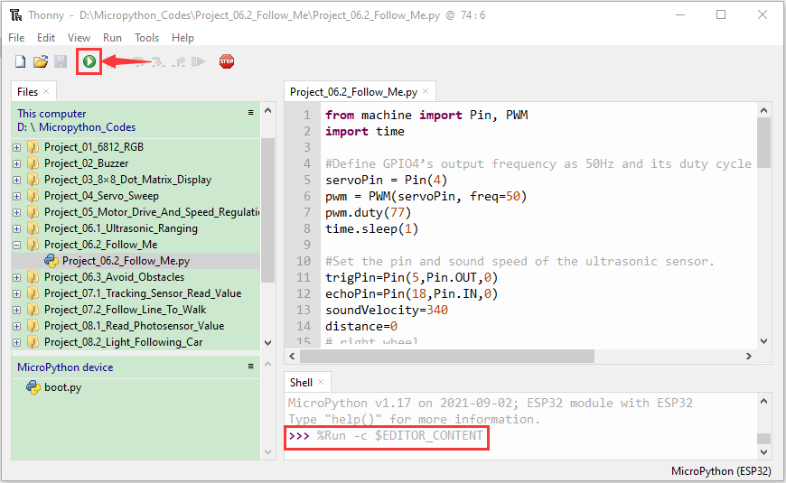

### Project 6.3: Dodge obstacles

1.  **Description：**

In this project, we will take advantage of the ultrasonic sensor to
detect the distance away from the obstacle so as to avoid them

2.  **Working Principle：**

<table>
<tbody>
<tr class="odd">
<td></td>
<td>8*8 Dot matrix display</td>
<td></td>
<td></td>
</tr>
<tr class="even">
<td></td>
<td>Set servo to 90°</td>
<td></td>
<td></td>
</tr>
<tr class="odd">
<td><strong>loop</strong></td>
<td>Detect the distance away from the obstacle（unit: cm）</td>
<td></td>
<td></td>
</tr>
<tr class="even">
<td></td>
<td>Condition 1</td>
<td>State</td>
<td></td>
</tr>
<tr class="odd">
<td></td>
<td><strong>0&lt;distance＜10</strong></td>
<td>Stop</td>
<td></td>
</tr>
<tr class="even">
<td></td>
<td></td>
<td>Show the“stop”pattern</td>
<td></td>
</tr>
<tr class="odd">
<td></td>
<td></td>
<td>Set the servo to 180°</td>
<td>Distance away form the obstacle：a1（unit：cm）</td>
</tr>
<tr class="even">
<td></td>
<td></td>
<td>Set the servo to 0°</td>
<td>Distance away form the obstacle：a2（unit：cm）</td>
</tr>
<tr class="odd">
<td></td>
<td></td>
<td>Condition 2</td>
<td>State</td>
</tr>
<tr class="even">
<td></td>
<td></td>
<td><strong>a1＜a2</strong></td>
<td>Car turns right（set PWM to 200）</td>
</tr>
<tr class="odd">
<td></td>
<td></td>
<td></td>
<td>show“turning right”pattern</td>
</tr>
<tr class="even">
<td></td>
<td></td>
<td></td>
<td>Set servo to 90°</td>
</tr>
<tr class="odd">
<td></td>
<td></td>
<td><strong>a1≥a2</strong></td>
<td>Turn left（set PWM to 200）</td>
</tr>
<tr class="even">
<td></td>
<td></td>
<td></td>
<td>display“left turning”pattern</td>
</tr>
<tr class="odd">
<td></td>
<td></td>
<td></td>
<td>Set servo to 90°</td>
</tr>
<tr class="even">
<td></td>
<td><strong>distance≥10</strong></td>
<td>The 8*8 dot matrix display shows“going forward”pattern</td>
<td></td>
</tr>
<tr class="odd">
<td></td>
<td></td>
<td>Go forward（set PWM to 200）</td>
<td></td>
</tr>
</tbody>
</table>

**3. Flow Chart：**

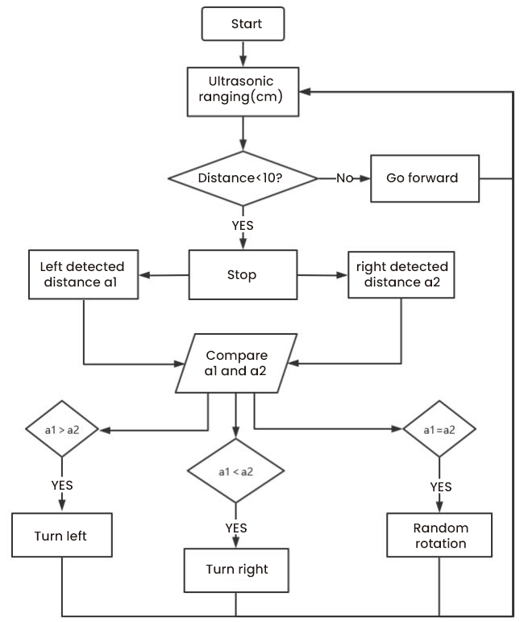

**4. Test Code：**

You can download test code from a link
[https://fs.keyestudio.com/KS50](https://fs.keyestudio.com/KS0470)02 You
can save the code anywhere. We save the code in the drive D of our
computer.

As shown below: D:\\Micropython\_Codes.

Open“Thonny”and click“This
computer”→“D:”→“Micropython\_Codes”→“Project\_06.3\_Avoid\_Obstacles”

Select“ht16k33.py”and“ht16k33matrix.py”and right-click“Upload to /”and
upload them to the ESP32；

Double-click Project\_06.3\_Avoid\_Obstacles.py as shown below:

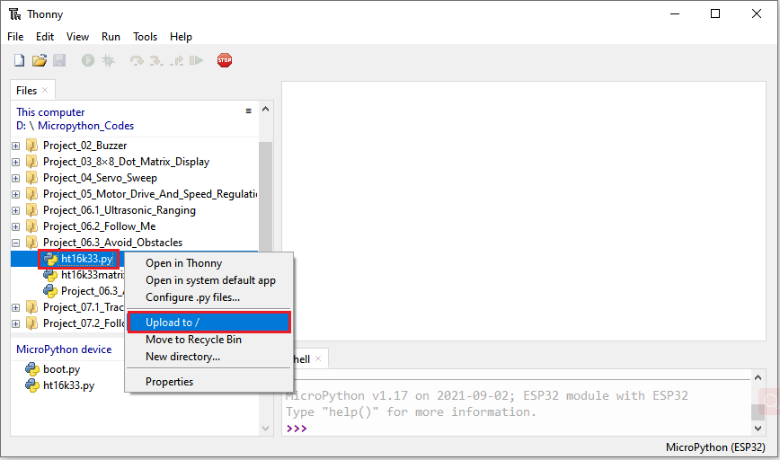

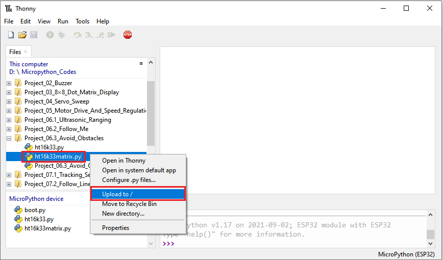

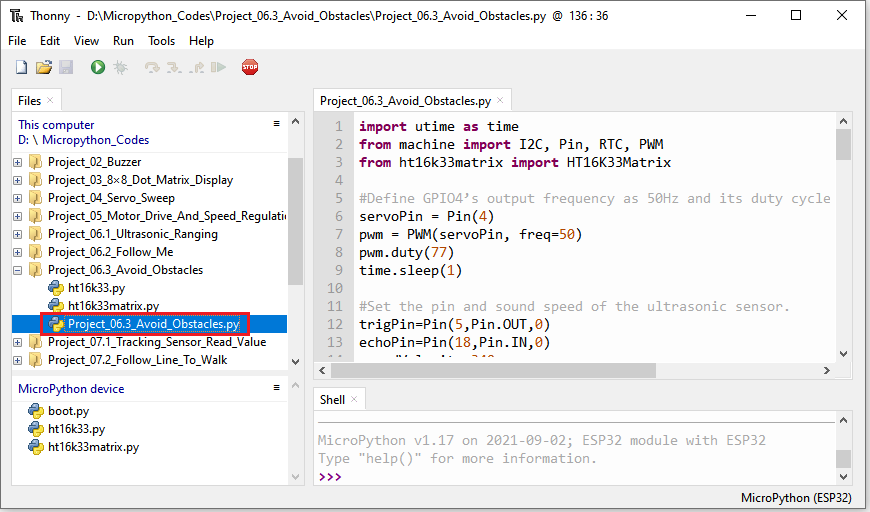

<table>
<tbody>
<tr class="odd">
<td>
import utime as time

from machine import I2C, Pin, RTC, PWM

from ht16k33matrix import HT16K33Matrix

#Define GPIO4’s output frequency as 50Hz and its duty cycle as 77, and assign them to PWM.

servoPin = Pin(4)

pwm = PWM(servoPin, freq=50)

pwm.duty(77)

time.sleep(1)

#Set the pin and sound speed of the ultrasonic sensor.

trigPin=Pin(5,Pin.OUT,0)

echoPin=Pin(18,Pin.IN,0)

soundVelocity=340

distance=0

# right wheel

pin1=Pin(32,Pin.OUT)

pin2=PWM(Pin(25),freq=50,duty=0)

# left wheel

pin3=Pin(33,Pin.OUT)

pin4=PWM(Pin(26),freq=50,duty=0)

# As a function of the car going forward.

def car_forward():

pin1.value(0)

pin2.duty(200)

pin3.value(0)

pin4.duty(250)

# As a function of the car going left.

def car_left():

pin1.value(0)

pin2.duty(500)

pin3.value(1)

pin4.duty(500)

# As a function of the car going right.

def car_right():

pin1.value(1)

pin2.duty(500)

pin3.value(0)

pin4.duty(500)

# As a function of the car stopping.

def car_stop():

pin2.deinit()

pin4.deinit()

pin1.value(0)

pin2.duty(0)

pin3.value(0)

pin4.duty(0)

#Subfunction getSonar() is used to start the Ultrasonic Module to begin measurements,

#and return the measured distance in centimeters. In this function, first let trigPin

#send 10us high level to start the Ultrasonic Module. Then use pulseIn() to read

#the Ultrasonic Module and return the duration time of high level.

#Finally, the measured distance according to the time is calculated.

def getSonar():

trigPin.value(1)

time.sleep_us(10)

trigPin.value(0)

while not echoPin.value():

pass

pingStart=time.ticks_us()

while echoPin.value():

pass

pingStop=time.ticks_us()

pingTime=time.ticks_diff(pingStop,pingStart)

distance=pingTime*soundVelocity//2//10000

time.sleep_ms(10)

return int(distance)

# CONSTANTS

DELAY = 0.01

PAUSE = 3

# START

if __name__ == '__main__':

i2c = I2C(scl=Pin(22), sda=Pin(21))

display = HT16K33Matrix(i2c)

display.set_brightness(2)

while True:

Distance=getSonar() #Get the distance measured by ultrasound.

if Distance&gt;0 and Distance&lt;10: #If the distance is greater than 0, it's less than 10.

car_stop() # Car stop

# Draw a custom icon on the LED

icon = b"\x18\x18\x18\x18\x18\x00\x00\x18"

display.set_icon(icon).draw()

# Rotate the icon

display.set_angle(0).draw()

time.sleep(0.2)

pwm = PWM(servoPin, freq=50)

pwm.duty(128)

time.sleep(0.3)

a1=getSonar()

time.sleep(0.2)

pwm = PWM(servoPin, freq=50)

pwm.duty(25)

time.sleep(0.3)

a2=getSonar()

time.sleep(0.2)

if a1&gt;a2:

pin2=PWM(Pin(25),freq=50)

pin4=PWM(Pin(26),freq=50)

car_left()

icon = b"\x48\x24\x12\x09\x09\x12\x24\x48"

display.set_icon(icon).draw()

display.set_angle(0).draw()

pwm = PWM(servoPin, freq=50)

pwm.duty(77)

time.sleep(0.3)

icon = b"\x18\x24\x42\x99\x24\x42\x81\x00"

display.set_icon(icon).draw()

display.set_angle(0).draw()

else:

pin2=PWM(Pin(25),freq=50)

pin4=PWM(Pin(26),freq=50)

car_right()

icon = b"\x12\x24\x48\x90\x90\x48\x24\x12"

display.set_icon(icon).draw()

# Rotate the icon

display.set_angle(0).draw()

pwm = PWM(servoPin, freq=50)

pwm.duty(77)

time.sleep(0.3)

icon = b"\x18\x24\x42\x99\x24\x42\x81\x00"

display.set_icon(icon).draw()

display.set_angle(0).draw()

else:

pin2=PWM(Pin(25),freq=50)

pin4=PWM(Pin(26),freq=50)

car_forward() #Car ahead

icon = b"\x18\x24\x42\x99\x24\x42\x81\x00"

display.set_icon(icon).draw()

display.set_angle(0).draw()
</td>
</tr>
</tbody>
</table>

**Test Result**

Connect the ESP32 board to your PC and click 

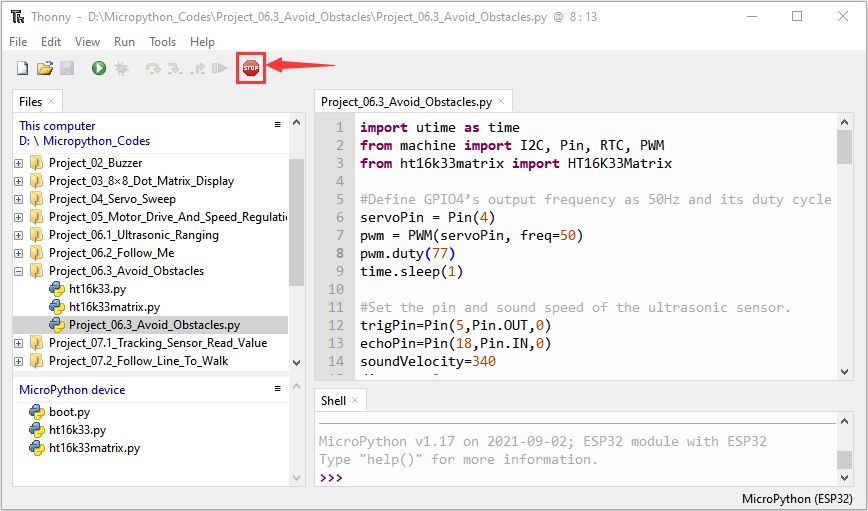

Place batteries, turn the power switch to ON end and power up.

Click , the script starts running, then the car
can automatically dodge obstacles; press“Ctrl+C”or click
 to exit

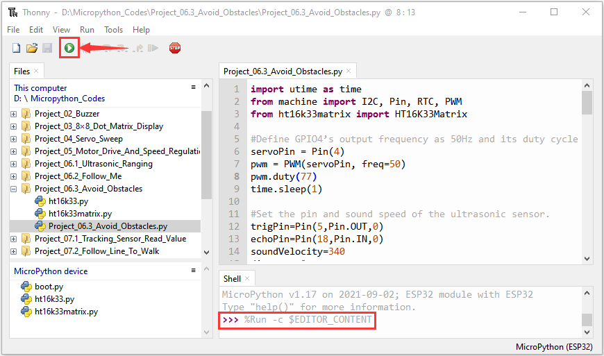

## Project 7: Line Tracking Sensor

There are two IR line tracking sensors on the car. They are actually two
pairs of ST188L3 infrared tubes and used to detect black and white
lines. In this project, we will make a line tracking car

### **Project 7.1: Reading Values**

**1.Description：**

In this experiment, we use ST188L3 infrared tubes to detect black and
white lines, then print the data on the serial monitor.

**2. Knowledge：**

**Infrared line tracking:**

The IR line tracking sensor boasts a pair of ST188L3 infrared tubes.
ST188L3 tubes has an infrared emitting diode and a receiver tube. When
the emitting diode emits an infrared signal then received by the
receiving tube after being reflected by the white object. Once the
receiving tube receives the signal, the output terminal will output a
low level (0); when the infrared emitting diode emits an infrared
signal, and the infrared signal is absorbed by the black object, a high
level (1) will be output, thus realizing the function of detecting
signals through infrared rays.

Warning: Reflective optical sensors (including IR line tracking sensors)
shouldn’t be applied under sunlight as there is a lot of invisible light
such as infrared and ultraviolet.

Values detected by the line tracking sensor are shown in the table.

The value will be 1 if detecting black or no objects and the value 0
will appear if detecting white objects.

he detected black object or no object represents 1, and the detected
white object represents 0.

<table>
<tbody>
<tr class="odd">
<td>Left</td>
<td>Right</td>
<td>Value（Binary ）</td>
</tr>
<tr class="even">
<td>0</td>
<td>0</td>
<td>00</td>
</tr>
<tr class="odd">
<td>0</td>
<td>1</td>
<td>01</td>
</tr>
<tr class="even">
<td>1</td>
<td>0</td>
<td>10</td>
</tr>
<tr class="odd">
<td>1</td>
<td>1</td>
<td>11</td>
</tr>
</tbody>
</table>

**3. Test Code：**

The line tracking sensors of the PCB board are controlled by GPIO17 and
GPIO16 of the ESP32 board.

You can download test code from a link
[https://fs.keyestudio.com/KS50](https://fs.keyestudio.com/KS0470)02 You
can save the code anywhere. We save the code in the drive D of our
computer.

As shown below: D:\\Micropython\_Codes.

Open“Thonny”and click“This
computer”→“D:”→“Micropython\_Codes”→“Project\_07.1\_Tracking\_Sensor\_Read\_Value”

Double-click Project\_07.1\_Tracking\_Sensor\_Read\_Value.py as shown
below:

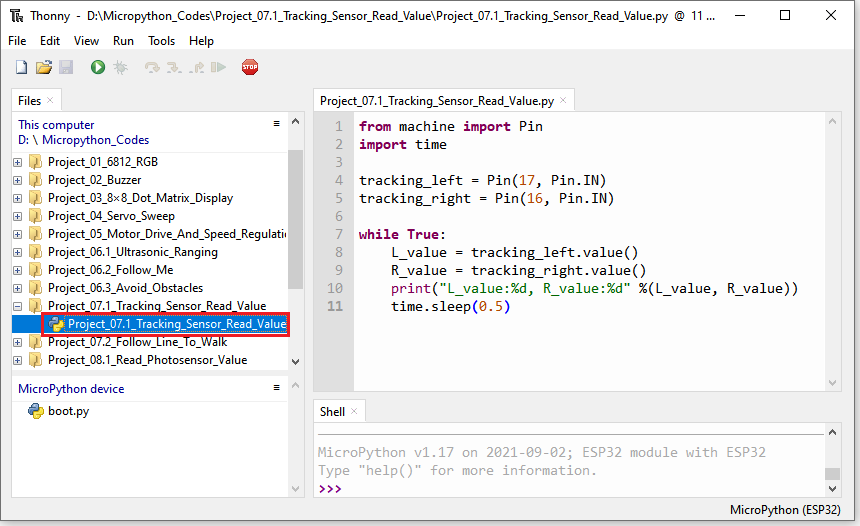

<table>
<tbody>
<tr class="odd">
<td>
from machine import Pin

import time

tracking_left = Pin(17, Pin.IN)

tracking_right = Pin(16, Pin.IN)

while True:

L_value = tracking_left.value()

R_value = tracking_right.value()

print("L_value:%d, R_value:%d" %(L_value, R_value))

time.sleep(0.5)
</td>
</tr>
</tbody>
</table>

**4.Test Result**

Connect the ESP32 board to your PC and click 

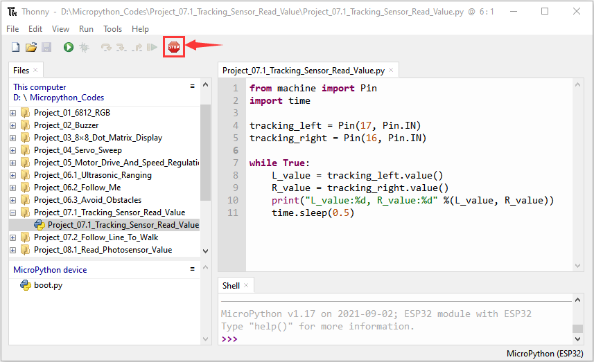

Click , the script starts running, Put a black
thing under the line tracking sensor of the car and move it, you will
see different indicators light up, and at the same time you will see the
value on the serial monitor.

Press“Ctrl+C”or click  to exit.

The sensitivity can be adjusted by rotating the potentiometer. When the
indicator light is adjusted to the critical point of on and off state,
the sensitivity is the highest.

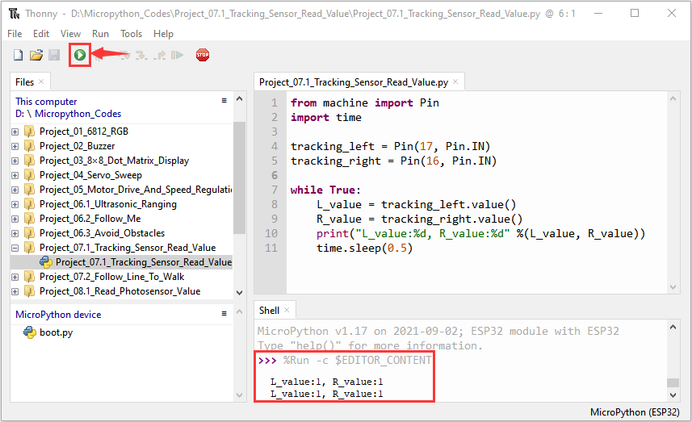

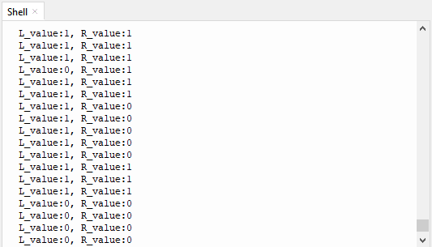

### Project 7.2: Line Tracking

**1.Description：**

We’ve introduced the knowledge of motor drivers, speed regulation, and
infrared line tracking. In this experiment, the car will perform
different actions according to the values transmitted by the infrared
tracking.

2.  **Working Principle：**

<table>
<tbody>
<tr class="odd">
<td>Left</td>
<td>Right</td>
<td>Value（Binary ）</td>
<td>State</td>
</tr>
<tr class="even">
<td>0</td>
<td>0</td>
<td>00</td>
<td>Stop</td>
</tr>
<tr class="odd">
<td>0</td>
<td>1</td>
<td>01</td>
<td>Turn right</td>
</tr>
<tr class="even">
<td>1</td>
<td>0</td>
<td>10</td>
<td>Turn left</td>
</tr>
<tr class="odd">
<td>1</td>
<td>1</td>
<td>11</td>
<td>Move forward</td>
</tr>
</tbody>
</table>

3.  **Flow Chart：**

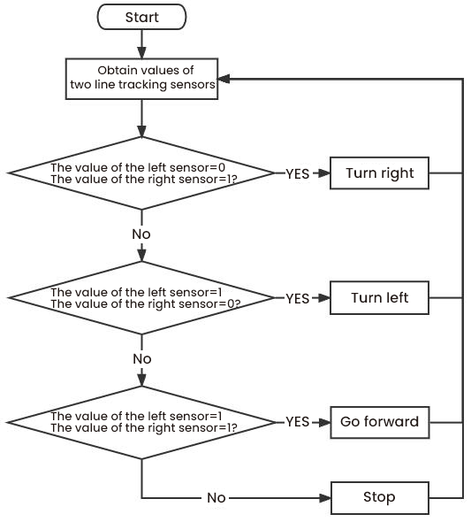

**4. Test Code：**

You can download test code from a link
[https://fs.keyestudio.com/KS50](https://fs.keyestudio.com/KS0470)02 You
can save the code anywhere. We save the code in the drive D of our
computer.

As shown below: D:\\Micropython\_Codes.

Open“Thonny”and click“This
computer”→“D:”→“Micropython\_Codes”→“Project\_07.2\_Follow\_Line\_To\_Walk”;

Double-click Project\_07.2\_Follow\_Line\_To\_Walk.py as shown below:

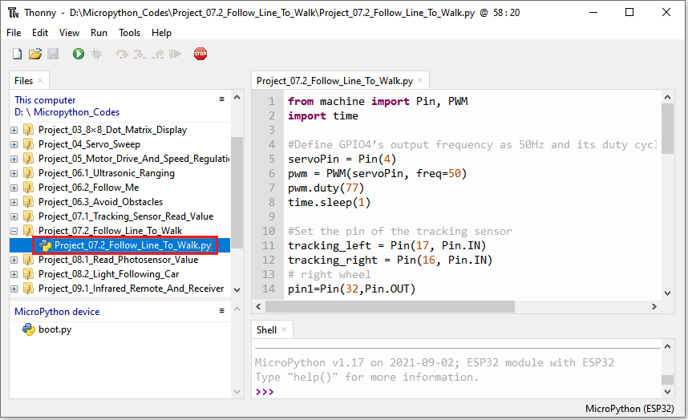

<table>
<tbody>
<tr class="odd">
<td>
from machine import Pin, PWM

import time

#Define GPIO4’s output frequency as 50Hz and its duty cycle as 77, and assign them to PWM.

servoPin = Pin(4)

pwm = PWM(servoPin, freq=50)

pwm.duty(77)

time.sleep(1)

#Set the pin of the tracking sensor

tracking_left = Pin(17, Pin.IN)

tracking_right = Pin(16, Pin.IN)

# right wheel

pin1=Pin(32,Pin.OUT)

pin2=PWM(Pin(25),freq=50,duty=0)

# left wheel

pin3=Pin(33,Pin.OUT)

pin4=PWM(Pin(26),freq=50,duty=0)

# As a function of the car going forward.

def car_forward():

pin1.value(0)

pin2.duty(200)

pin3.value(0)

pin4.duty(200)

# As a function of the car going left.

def car_left():

pin1.value(0)

pin2.duty(180)

pin3.value(1)

pin4.duty(1023)

# As a function of the car going right.

def car_right():

pin1.value(1)

pin2.duty(1023)

pin3.value(0)

pin4.duty(220)

# As a function of the car stopping.

def car_stop():

pin2.deinit()

pin4.deinit()

pin1.value(0)

pin2.duty(0)

pin3.value(0)

pin4.duty(0)

while True:

L_value = tracking_left.value() #Left infrared tracking value is assigned to the variable L_value.

R_value = tracking_right.value() #Right infrared tracking value is assigned to the variable R_value.

if L_value == 1 and R_value == 1: #Black lines were detected in both left and right infrared tracking.

pin2=PWM(Pin(25),freq=50)

pin4=PWM(Pin(26),freq=50)

car_forward() #Car ahead

elif L_value == 1 and R_value == 0:

pin2=PWM(Pin(25),freq=50)

pin4=PWM(Pin(26),freq=50)

car_left()

elif L_value == 0 and R_value == 1:

pin2=PWM(Pin(25),freq=50)

pin4=PWM(Pin(26),freq=50)

car_right()

else:

car_stop()
</td>
</tr>
</tbody>
</table>

**Test Result**

Connect the ESP32 board to your PC and click 

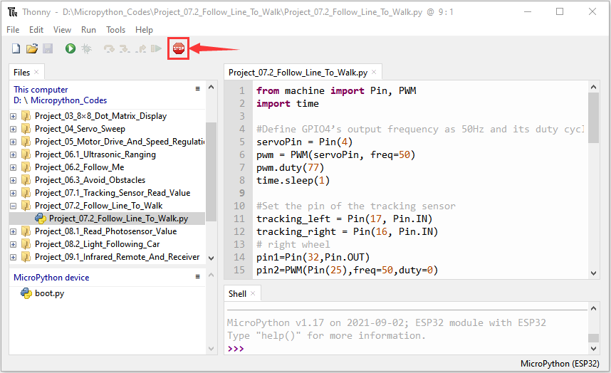

Place batteries, turn the power switch to ON end and power up.

Click , the script starts running, then it will
perform different functions via values sent by line tracking sensors;
press“Ctrl+C”or click  to exit.

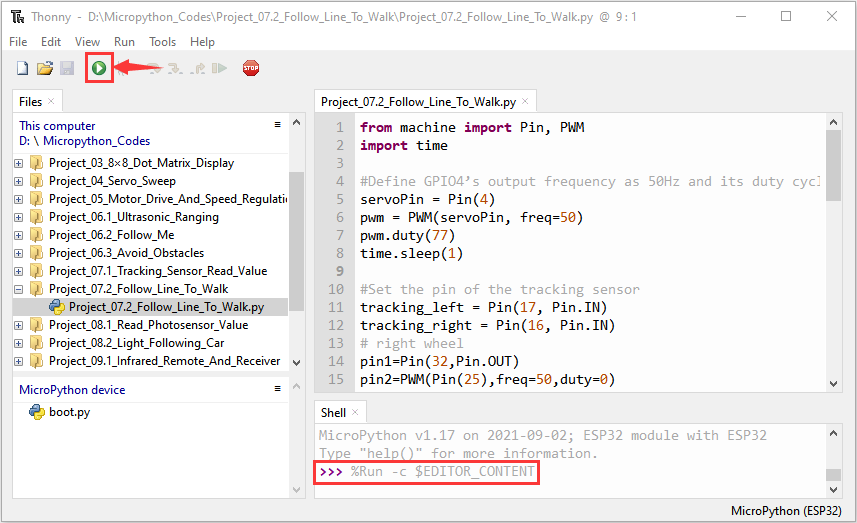

## Project 8: Light Following

There are two photoresistors on the car. They can vary with the light
intensity and send information to the Nano board to control the car.

Photoresistors can determine and conduct the car to move by detecting
light

### Project 8.1 Read Values

1.  **Description：**

In this experiment, we will learn the working principle of the
photoresistor

**2. Knowledge：**

**Photoresistor:**

It mainly uses a photosensitive resistance element whose resistance
varies from the light intensity. The signal terminal of the sensor is
connected to the analog port of the microcontroller. When the light is
stronger, the analog value at the analog port will increase; on the
contrary, when the light intensity is weaker, the analog value of the
microcontroller will reduce. In this way, the corresponding analog value
can reflect the ambient light intensity.

**3. Wire up：**

Through the wiring-up diagram, signal pins of two photoresistors are
connected to GPIO34 and GPIO35 of the ESP32 board.

For the following experiment, we use the photoresistor connected to
GPIO34 to finish experiments. First, let’s read analog values.

<table>
<tbody>
<tr class="odd">
<td>Left photoresistor</td>
<td>PCB board</td>
</tr>
<tr class="even">
<td>G</td>
<td>G</td>
</tr>
<tr class="odd">
<td>V</td>
<td>V</td>
</tr>
<tr class="even">
<td>S</td>
<td>S（GPIO34）</td>
</tr>
</tbody>
</table>

**4. Test Code：**

The left photoresistor is controlled by the GPIO34 of the ESP32 board.

You can download test code from a link
[https://fs.keyestudio.com/KS50](https://fs.keyestudio.com/KS0470)02 You
can save the code anywhere. We save the code in the drive D of our
computer.

As shown below: D:\\Micropython\_Codes.

Open“Thonny”and click“This
computer”→“D:”→“Micropython\_Codes”→“Project\_08.1\_Read\_Photosensor\_Value”

Double-click Project\_08.1\_Read\_Photosensor\_Value.py as shown below:

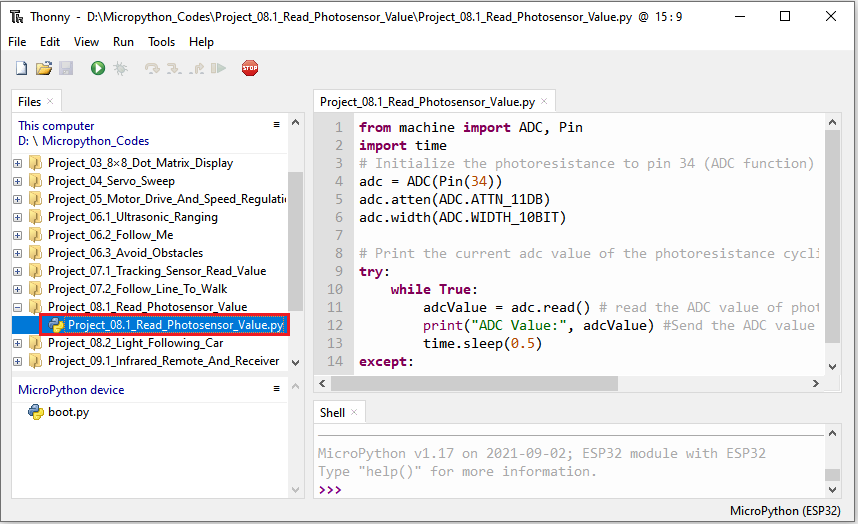

<table>
<tbody>
<tr class="odd">
<td>
from machine import ADC, Pin

import time

# Initialize the photoresistance to pin 34 (ADC function)

adc = ADC(Pin(34))

adc.atten(ADC.ATTN_11DB)

adc.width(ADC.WIDTH_10BIT)

# Print the current adc value of the photoresistance cyclically

try:

while True:

adcValue = adc.read() # read the ADC value of photoresistance

print("ADC Value:", adcValue) #Send the ADC value of photoresistance and print the result.

time.sleep(0.5)

except:

pass
</td>
</tr>
</tbody>
</table>

**5. Test Result**

Connect the ESP32 board to your PC and click 

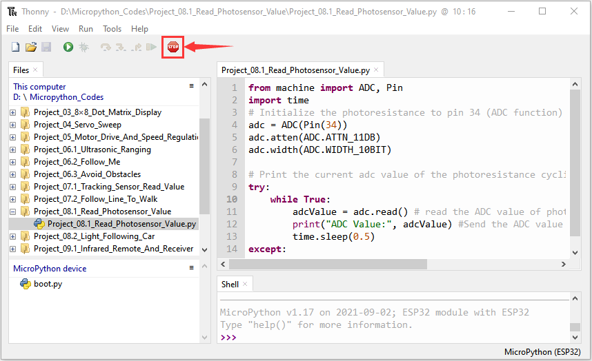

Click “Run current script”, the Shell monitor
will show scripts and code will be run.

When the light intensifies, the analog value will get increased; on the
contrary, the analog value will get reduced.

Press“Ctrl+C”or click  to exit

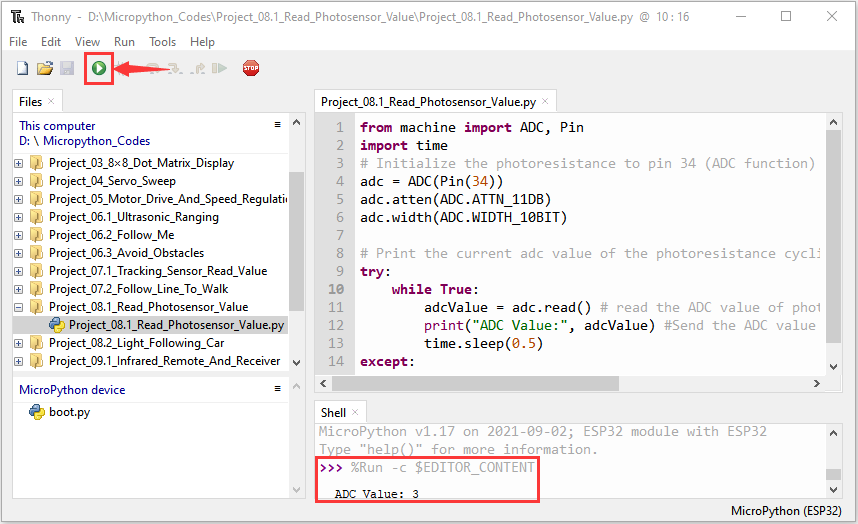

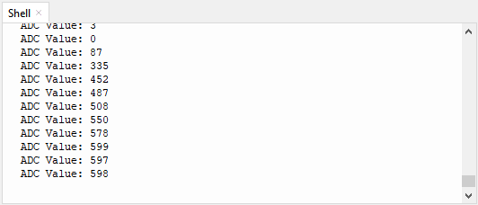

### Project 8.2: Light Following Car

1.  **Description：**

We have learned the working principle of photoresistor, motor and speed
regulation. In this experiment, we will use a photoresistor to detect
the intensity of light as as to achieve the light following effect.

2.  **Working Principle：**

<table>
<tbody>
<tr class="odd">
<td>Analog value of the left sensor</td>
<td>Analog value of the right sensor</td>
<td>Function</td>
</tr>
<tr class="even">
<td>&gt;700</td>
<td>&gt;700</td>
<td>Move forward</td>
</tr>
<tr class="odd">
<td>&gt;700</td>
<td>≤700</td>
<td>Move to left</td>
</tr>
<tr class="even">
<td>≤700</td>
<td>&gt;700</td>
<td>Move to right</td>
</tr>
<tr class="odd">
<td>&lt;700</td>
<td>&lt;700</td>
<td>Stop</td>
</tr>
</tbody>
</table>

3.  **Wiring up：**

<table>
<tbody>
<tr class="odd">
<td>Left Photoresistor</td>
<td>
PCB

Board
</td>
<td></td>
<td>Right photoresistor</td>
<td>
PCB

Board
</td>
</tr>
<tr class="even">
<td>G</td>
<td>G</td>
<td></td>
<td>G</td>
<td>G</td>
</tr>
<tr class="odd">
<td>V</td>
<td>V</td>
<td></td>
<td>V</td>
<td>V</td>
</tr>
<tr class="even">
<td>S</td>
<td>S（GPIO34）</td>
<td></td>
<td>S</td>
<td>S（GPIO35）</td>
</tr>
</tbody>
</table>

4.  **Test Code：**

The left and right photoresistors are controlled by GPIO34 and GPIO35 of
the ESP32 board.

You can download test code from a link
[https://fs.keyestudio.com/KS50](https://fs.keyestudio.com/KS0470)02 You
can save the code anywhere. We save the code in the drive D of our
computer.

As shown below: D:\\Micropython\_Codes.

Open“Thonny”and click“This
computer”→“D:”→“Micropython\_Codes”→“Project\_08.2\_Light\_Following\_Car”

Double-click Project\_08.2\_Light\_Following\_Car.py as shown below:

<table>
<tbody>
<tr class="odd">
<td>
from machine import Pin, ADC, PWM

import time

#Define GPIO4’s output frequency as 50Hz and its duty cycle as 77, and assign them to PWM.

servoPin = Pin(4)

pwm = PWM(servoPin, freq=50)

pwm.duty(77)

time.sleep(1)

# Initialize the left photoresistance to pin 34 (ADC function)

adc1 = ADC(Pin(34))

adc1.atten(ADC.ATTN_11DB)

adc1.width(ADC.WIDTH_10BIT)

# Initialize the right photoresistance to pin 35 (ADC function)

adc2 = ADC(Pin(35))

adc2.atten(ADC.ATTN_11DB)

adc2.width(ADC.WIDTH_10BIT)

# right wheel

pin1=Pin(32,Pin.OUT)

pin2=PWM(Pin(25),freq=50,duty=0)

# left wheel

pin3=Pin(33,Pin.OUT)

pin4=PWM(Pin(26),freq=50,duty=0)

# As a function of the car going forward.

def car_forward():

pin1.value(0)

pin2.duty(300)

pin3.value(0)

pin4.duty(300)

# As a function of the car going backwards.

def car_back():

pin1.value(1)

pin2.duty(200)

pin3.value(1)

pin4.duty(200)

# As a function of the car going left.

def car_left():

pin1.value(0)

pin2.duty(200)

pin3.value(1)

pin4.duty(900)

# As a function of the car going right.

def car_right():

pin1.value(1)

pin2.duty(900)

pin3.value(0)

pin4.duty(200)

# As a function of the car stopping.

def car_stop():

pin2.deinit()

pin4.deinit()

pin1.value(0)

pin2.duty(0)

pin3.value(0)

pin4.duty(0)

while True:

adcValue1 = adc1.read() # read the ADC value of the left photoresistance.

adcValue2 = adc2.read() # read the ADC value of the right photoresistance.

print("ADC Value1:", adcValue1 ,"ADC Value2:", adcValue2)

time.sleep(0.5)

if adcValue1 &gt; 700 and adcValue2 &gt; 700: #Range values measured by left and right photoresistances.

pin2=PWM(Pin(25),freq=50)

pin4=PWM(Pin(26),freq=50)

car_forward() #Car ahead

elif adcValue1 &gt; 700 and adcValue2 &lt;= 700:

pin2=PWM(Pin(25),freq=50)

pin4=PWM(Pin(26),freq=50)

car_left()

elif adcValue1 &lt;= 700 and adcValue2 &gt; 700:

pin2=PWM(Pin(25),freq=50)

pin4=PWM(Pin(26),freq=50)

car_right()

else:

car_stop()
</td>
</tr>
</tbody>
</table>

5.  **Test Result**

Connect the ESP32 board to your PC and click 

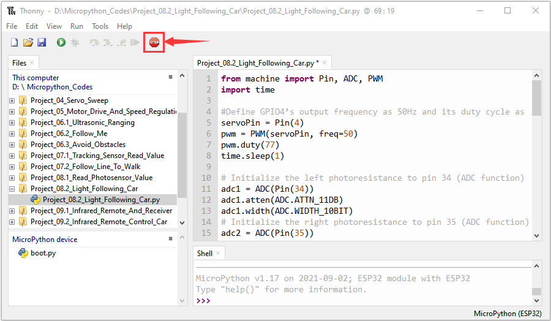

Place batteries, turn the power switch to ON end and power up.

Click , the script starts running, the car will
follow the light to move.; press“Ctrl+C”or click 
to exit

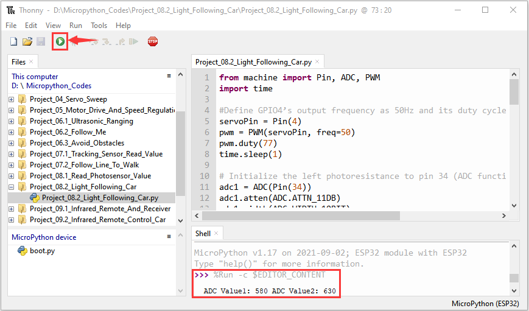

## Project 9: IR Remote Control

Infrared remote controls are everywhere in daily life. It is used to
control various home appliances, such as TV, speakers, video recorders
and satellite signal receivers.

The remote control is composed of an IR emitter, an IR receiver and a
decoding MCU. In this project, we will make a IR remote control car.

### Project 9.1: IR Remote and Reception

**1.Description：**

In this experiment, we will combine the IR receiver and the IR remote
control to read key values and show them on the serial monitor.

2.  **Knowledge：**

**IR Remote Control：**

It is a device with buttons. When the key is pressed, IR signals will be
sent.

Infrared remote control technology is widely used, such as TVs, air
conditioners and so on. And it can control air conditioners and TVs

The infrared remote control adopts NEC coding, and the signal period is
110ms.

The remote control is shown below:

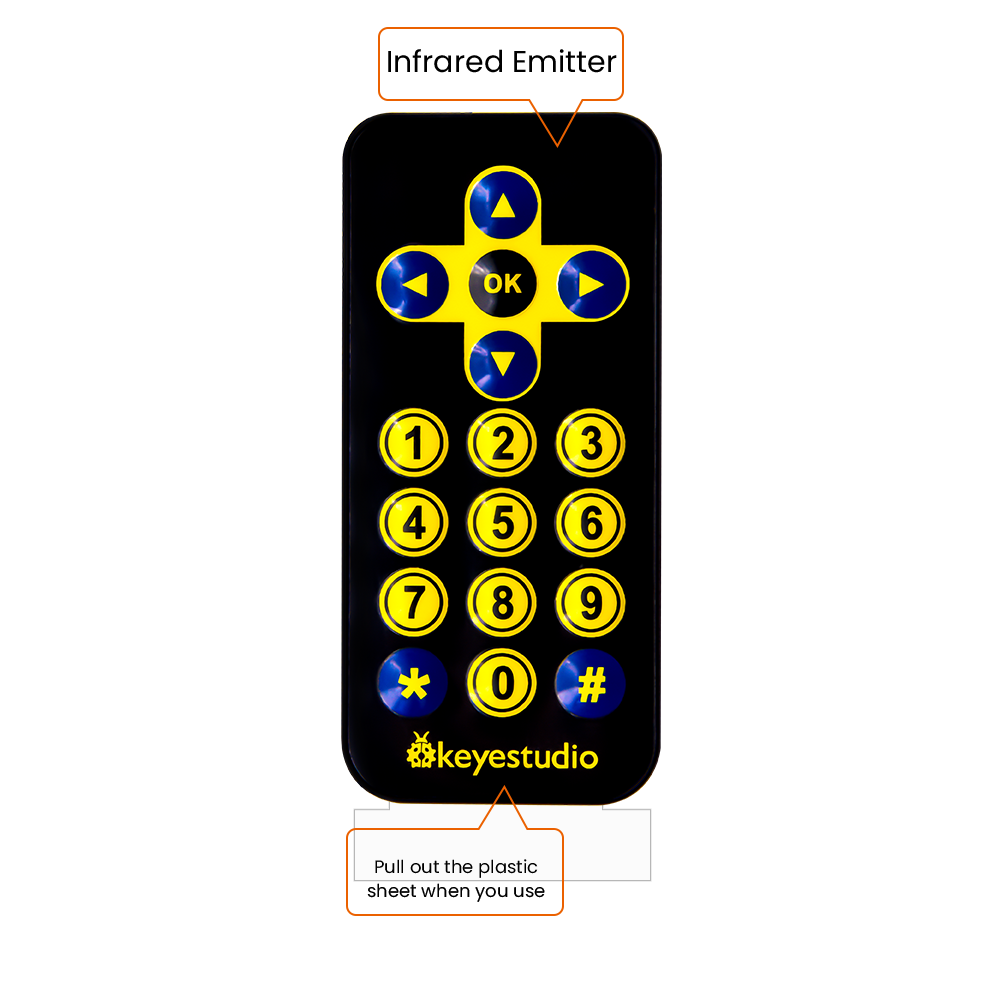

Infrared (IR) receiver:

It can receive infrared light and be used to detect the infrared signal
emitted by the infrared remote control.

It can demodulate the received infrared light signal and convert it back
to binary, and then transmit the information to the microcontroller.

**NEC Infrared communication protocol：**

**NEC Protocol**

To my knowledge the protocol I describe here was developed by NEC (Now
Renesas). I've seen very similar protocol descriptions on the internet,
and there the protocol is called Japanese Format.

I do admit that I don't know exactly who developed it. What I do know is
that it was used in my late VCR produced by Sanyo and was marketed under
the name of Fisher. NEC manufactured the remote control IC.

This description was taken from my VCR's service manual. Those were the
days, when service manuals were filled with useful information\!

**Features**

  - 8 bit address and 8 bit command length.

  - Extended mode available, doubling the address size.

  - Address and command are transmitted twice for reliability.

  - Pulse distance modulation.

  - Carrier frequency of 38kHz.

  - Bit time of 1.125ms or 2.25ms.

**Modulation**

The NEC protocol uses pulse distance encoding of the bits. Each pulse is
a 560µs long 38kHz carrier burst (about 21 cycles). A logical "1" takes
2.25ms to transmit, while a logical "0" is only half of that, being
1.125ms. The recommended carrier duty-cycle is 1/4 or 1/3

**Protocol**

The picture above shows a typical pulse train of the NEC protocol. With
this protocol the LSB is transmitted first. In this case Address $59 and
Command $16 is transmitted. A message is started by a 9ms AGC burst,
which was used to set the gain of the earlier IR receivers. This AGC
burst is then followed by a 4.5ms space, which is then followed by the
Address and Command. Address and Command are transmitted twice. The
second time all bits are inverted and can be used for verification of
the received message. The total transmission time is constant because
every bit is repeated with its inverted length. If you're not interested
in this reliability you can ignore the inverted values, or you can
expand the Address and Command to 16 bits each\!

Keep in mind that one extra 560µs burst has to follow at the end of the
message in order to be able to determine the value of the last bit.

A command is transmitted only once, even when the key on the remote
control remains pressed. Every 110ms a repeat code is transmitted for as
long as the key remains down. This repeat code is simply a 9ms AGC pulse
followed by a 2.25ms space and a 560µs burst.

**Extended NEC protocol**

The NEC protocol is so widely used that soon all possible addresses were
used up. By sacrificing the address redundancy the address range was
extended from 256 possible values to approximately 65000 different
values. This way the address range was extended from 8 bits to 16 bits
without changing any other property of the protocol.

By extending the address range this way the total message time is no
longer constant. It now depends on the total number of 1's and 0's in
the message. If you want to keep the total message time constant you'll
have to make sure the number 1's in the address field is 8 (it
automatically means that the number of 0's is also 8). This will reduce
the maximum number of different addresses to just about 13000.

The command redundancy is still preserved. Therefore each address can
still handle 256 different commands.

Keep in mind that 256 address values of the extended protocol are
invalid because they are in fact normal NEC protocol addresses. Whenever
the low byte is the exact inverse of the high byte it is not a valid
extended address.

**3.Test Code：**

The IR receiver on the PCB board is controlled by GPIO19 of the ESP32
board.

You can download test code from a link
[https://fs.keyestudio.com/KS50](https://fs.keyestudio.com/KS0470)02 You
can save the code anywhere. We save the code in the drive D of our
computer.

As shown below: D:\\Micropython\_Codes.

Open“Thonny”and click“This
computer”→“D:”→“Micropython\_Codes”→“Project\_09.1\_Infrared\_Remote\_And\_Receiver”.
Select“irrecvdata.py”and right-click“Upload to /” and upload
irrecvdata.py to ESP32

Double-click Project\_09.1\_Infrared\_Remote\_And\_Receiver.py as shown
below:

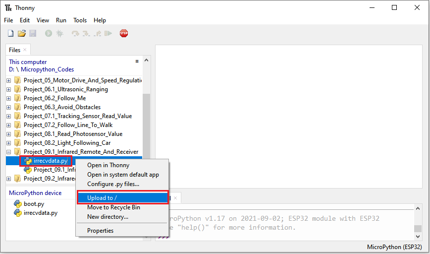

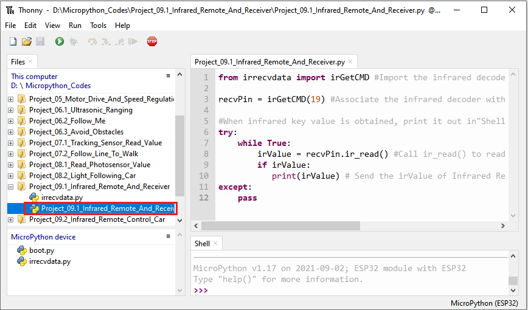

<table>
<tbody>
<tr class="odd">
<td>
from irrecvdata import irGetCMD #Import the infrared decoder.

recvPin = irGetCMD(19) #Associate the infrared decoder with Pin(19).

#When infrared key value is obtained, print it out in"Shell" repetitively.

try:

while True:

irValue = recvPin.ir_read() #Call ir_read() to read the value of the pressed key and assign it to IRValue.

if irValue:

print(irValue) # Send the irValue of Infrared Receiver and print the result.

except:

pass
</td>
</tr>
</tbody>
</table>

**5.Test Result**

Connect the ESP32 board to your PC and click 

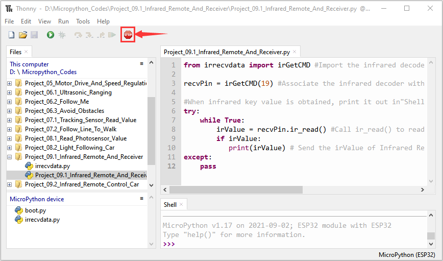

Click , the script starts running. Point the IR
remote control at the IR receiver and press keys on the remote control,
then the monitor will display key values.

Press“Ctrl+C”or click  to exit

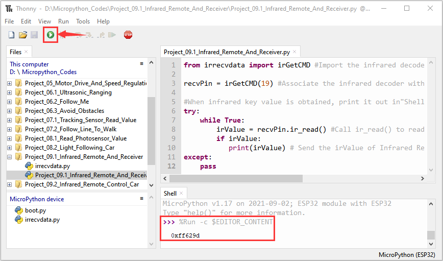

**Code of each key**

### Project 9.2: IR Remote Control Car

**1.Description：**

In the above experiment, we have learned about the knowledge of the 8\*8
dot matrix display, the motor driver and speed regulation, the infrared
receiver and the infrared remote control. In this experiment, we will
use the infrared remote control and the infrared receiver to control the
car.

**2. Working Principle：**

<table>
<tbody>
<tr class="odd">
<td>Keys</td>
<td>Keys Code</td>
<td>Functions</td>
</tr>
<tr class="even">
<td></td>
<td>FF629D</td>
<td>Go forward</td>
</tr>
<tr class="odd">
<td></td>
<td></td>
<td>Display “forward”pattern</td>
</tr>
<tr class="even">
<td></td>
<td>FFA857</td>
<td>Go back</td>
</tr>
<tr class="odd">
<td></td>
<td></td>
<td>Display “back”pattern</td>
</tr>
<tr class="even">
<td></td>
<td>FF22DD</td>
<td>Turn left</td>
</tr>
<tr class="odd">
<td></td>
<td></td>
<td>Show“left” pattern</td>
</tr>
<tr class="even">
<td></td>
<td>FFC23D</td>
<td>Turn right</td>
</tr>
<tr class="odd">
<td></td>
<td></td>
<td>Show“right turning”pattern</td>
</tr>
<tr class="even">
<td></td>
<td>FF02FD</td>
<td>stop</td>
</tr>
<tr class="odd">
<td></td>
<td></td>
<td>show“stop”pattern</td>
</tr>
</tbody>
</table>

3.  **Flow Chart：**

4.  **Test Code：**

You can download test code from a link
[https://fs.keyestudio.com/KS50](https://fs.keyestudio.com/KS0470)02 You
can save the code anywhere. We save the code in the drive D of our
computer.

As shown below: D:\\Micropython\_Codes.

Open“Thonny”and click“This
computer”→“D:”→“Micropython\_Codes”→“Project\_04\_Servo\_Sweep”，select“ht16k33.py,”,“ht16k33matrix.py”and“irrecvdata.py”,
right-click Upload to /”to upload them to the ESP32

Double-click Project\_09.2\_Infrared\_Remote\_Control\_Car.py as shown
below:

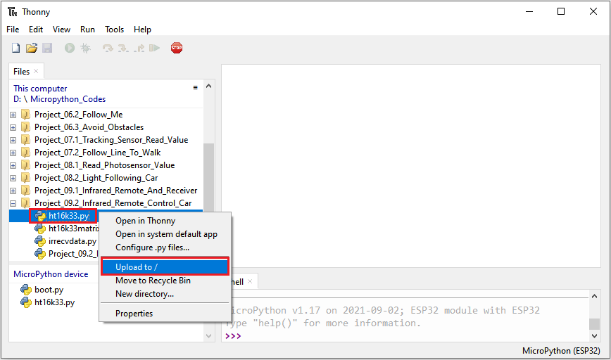

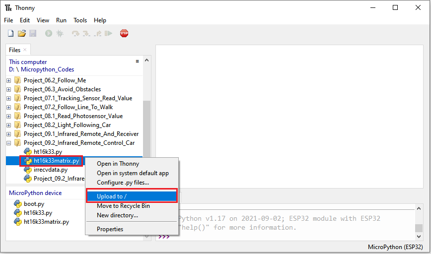

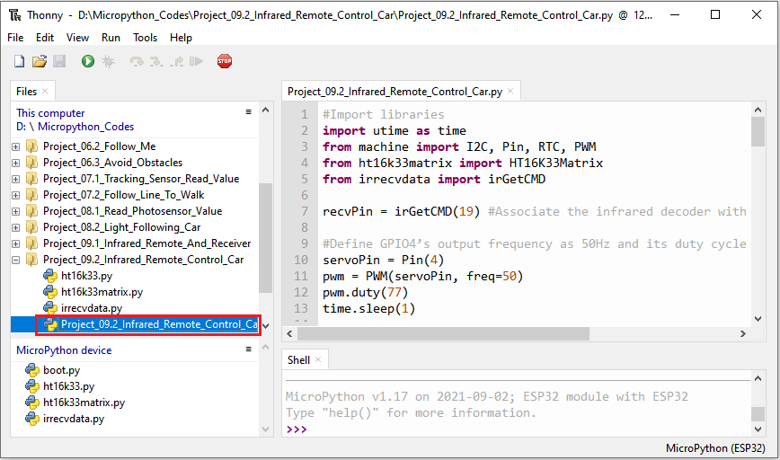

<table>
<tbody>
<tr class="odd">
<td>
#Import libraries

import utime as time

from machine import I2C, Pin, RTC, PWM

from ht16k33matrix import HT16K33Matrix

from irrecvdata import irGetCMD

recvPin = irGetCMD(19) #Associate the infrared decoder with Pin(19).

#Define GPIO4’s output frequency as 50Hz and its duty cycle as 77, and assign them to PWM.

servoPin = Pin(4)

pwm = PWM(servoPin, freq=50)

pwm.duty(77)

time.sleep(1)

# right wheel

pin1=Pin(32,Pin.OUT)

pin2=PWM(Pin(25),freq=50,duty=0)

# left wheel

pin3=Pin(33,Pin.OUT)

pin4=PWM(Pin(26),freq=50,duty=0)

# CONSTANTS

DELAY = 0.01

PAUSE = 3

# START

if __name__ == '__main__':

i2c = I2C(scl=Pin(22), sda=Pin(21))

display = HT16K33Matrix(i2c)

display.set_brightness(2)

# As a function of the car going forward.

def car_forward():

pin1.value(0)

pin2.duty(1000)

pin3.value(0)

pin4.duty(1000)

# As a function of the car going backwards.

def car_back():

pin1.value(1)

pin2.duty(250)

pin3.value(1)

pin4.duty(250)

# As a function of the car going left.

def car_left():

pin1.value(0)

pin2.duty(1000)

pin3.value(1)

pin4.duty(500)

# As a function of the car going right.

def car_right():

pin1.value(1)

pin2.duty(500)

pin3.value(0)

pin4.duty(1000)

# As a function of the car stopping.

def car_stop():

pin2.deinit()

pin4.deinit()

pin1.value(0)

pin2.duty(0)

pin3.value(0)

pin4.duty(0)

def handleControl(value):

if value == '0xff629d':

pin2=PWM(Pin(25),freq=50)

pin4=PWM(Pin(26),freq=50)

car_forward() #Car ahead

# Dot matrix shows a forward pattern

icon = b"\x18\x24\x42\x99\x24\x42\x81\x00"

display.set_icon(icon).draw()

display.set_angle(0).draw()

time.sleep(PAUSE)

elif value == '0xffa857':

pin2=PWM(Pin(25),freq=50)

pin4=PWM(Pin(26),freq=50)

car_back() # Car goes back

# Dot matrix shows a backward pattern

icon = b"\x00\x81\x42\x24\x99\x42\x24\x18"

display.set_icon(icon).draw()

display.set_angle(0).draw()

time.sleep(PAUSE)

elif value == '0xff22dd':

pin2=PWM(Pin(25),freq=50)

pin4=PWM(Pin(26),freq=50)

car_left() # Car to the left

# Dot matrix shows a left pattern

icon = b"\x48\x24\x12\x09\x09\x12\x24\x48"

display.set_icon(icon).draw()

display.set_angle(0).draw()

time.sleep(PAUSE)

elif value == '0xffc23d':

pin2=PWM(Pin(25),freq=50)

pin4=PWM(Pin(26),freq=50)

car_right() # Car to the right

# Dot matrix displays a right pattern

icon = b"\x12\x24\x48\x90\x90\x48\x24\x12"

display.set_icon(icon).draw()

display.set_angle(0).draw()

time.sleep(PAUSE)

elif value == '0xff02fd':

car_stop() # Car to the right

# Dot matrix displays a stop pattern

icon = b"\x18\x18\x18\x18\x18\x00\x00\x18"

display.set_icon(icon).draw()

display.set_angle(0).draw()

time.sleep(PAUSE)

try:

while True:

irValue = recvPin.ir_read() #Call ir_read() to read the value of the pressed key and assign it to IRValue.

if irValue:

print(irValue)

handleControl(irValue)

except:

pass
</td>
</tr>
</tbody>
</table>

**Test Result**

Connect the ESP32 board to your PC and click 

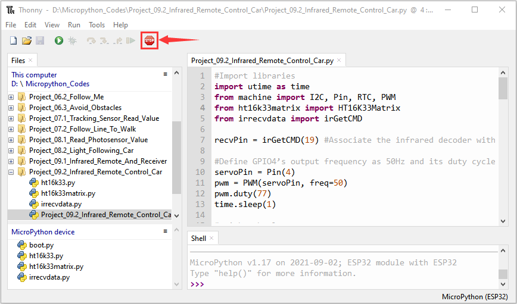

Place batteries, turn the power switch to ON end and power up.

Click , the script starts running, point the
remote control at the IR receiver and press keys, then the car will make
the corresponding movement.; press“Ctrl+C”or click
 to exit.

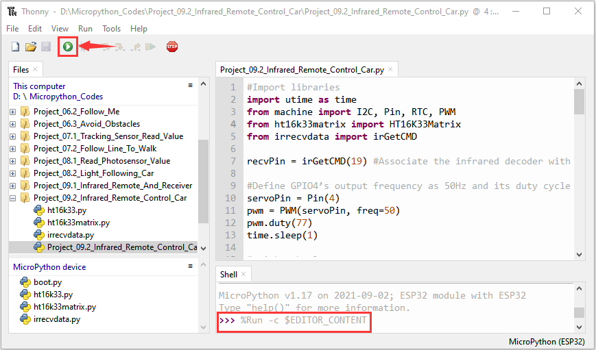

## Project 10: WIFI Working Mode

In this chapter, we will focus on the WiFi infrastructure of the ESP32.
ESP32 has 3 different WiFi working modes: Station mode, AP mode and
AP+Station mode. All WiFi programming projects must configure WiFi
operating mode before using WiFi, otherwise WiFi cannot be used.

### Project 10.1：WIFI Station Mode

1.  **Components**

<table>
<tbody>
<tr class="odd">
<td></td>
<td></td>
</tr>
<tr class="even">
<td>USB Cable x1</td>
<td>ESP32*1</td>
</tr>
</tbody>
</table>

Plug the ESP32 to the USB port of your PC

**Component Knowledge：**

**Station mode：**

When setting Station mode, the ESP32 is taken as a WiFi client. It can
connect to the router network and communicate with other devices on the
router via a WiFi connection. As shown in the figure below, the PC and
the router have been connected. If the ESP32 wants to communicate with
the PC, the PC and the router need to be connected.

**2. Test Code：**

You can download test code from a link
[https://fs.keyestudio.com/KS50](https://fs.keyestudio.com/KS0470)02 You
can save the code anywhere. We save the code in the drive D of our
computer.

As shown below: D:\\Micropython\_Codes.

Open“Thonny”and click“This
computer”→“D:”→“Micropython\_Codes”→“Project\_10.1\_WiFi\_Station\_Mode”

Double-click Project\_10.1\_WiFi\_Station\_Mode.py as shown below:

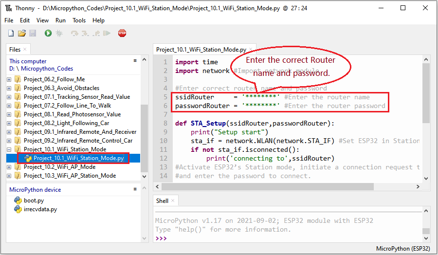

<table>
<tbody>
<tr class="odd">
<td>
import time

import network #Import network module

#Enter correct router name and password

ssidRouter = '********' #Enter the router name

passwordRouter = '********' #Enter the router password

def STA_Setup(ssidRouter,passwordRouter):

print("Setup start")

sta_if = network.WLAN(network.STA_IF) #Set ESP32 in Station mode

if not sta_if.isconnected():

print('connecting to',ssidRouter)

#Activate ESP32’s Station mode, initiate a connection request to the router

#and enter the password to connect.

sta_if.active(True)

sta_if.connect(ssidRouter,passwordRouter)

#Wait for ESP32 to connect to router until they connect to each other successfully.

while not sta_if.isconnected():

pass

#Print the IP address assigned to ESP32 in “Shell”.

print('Connected, IP address:', sta_if.ifconfig())

print("Setup End")

try:

STA_Setup(ssidRouter,passwordRouter)

except:

sta_if.disconnect()
</td>
</tr>
</tbody>
</table>

5.  **Test Result**
    
    Since the router name and password are different in various places,
    before running the code, the user needs to enter the correct router
    name and password in the red box shown above.

After entering the correct router name and password, click
, the code will be run.

The Shell monitor will print the IP address of the ESP32 when connecting
the ESP32 to your router.

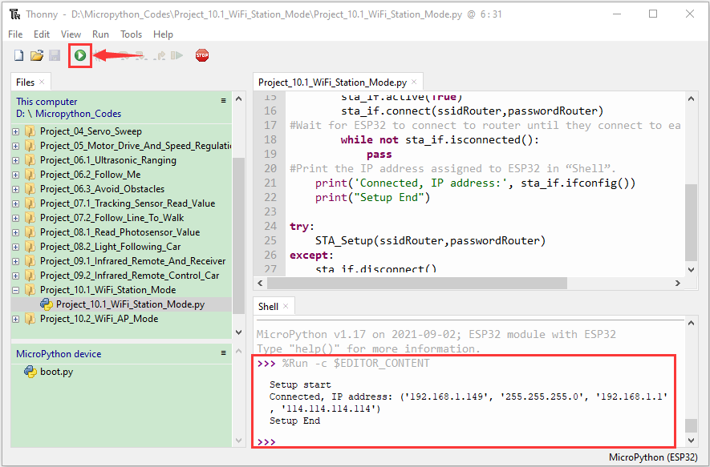

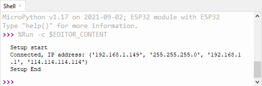

### Project 10.2：WIFI AP Mode

**Component Knowledge：**

**AP Mode:**

When setting AP mode, a hotspot network will be created, waiting for
other WiFi devices to connect. As shown below;

take the ESP32 as the hotspot. If a phone or PC needs to communicate
with the ESP32, it must be connected to the ESP32's hotspot.
Communication is only possible after a connection is established via the
ESP32.

**3. Test Code:**

You can download test code from a link
[https://fs.keyestudio.com/KS50](https://fs.keyestudio.com/KS0470)02 You
can save the code anywhere. We save the code in the drive D of our
computer.

As shown below: D:\\Micropython\_Codes.

Open“Thonny”and click“This
computer”→“D:”→“Micropython\_Codes”“Project\_10.2\_WiFi\_AP\_Mode”

Double-click“Project\_10.2\_WiFi\_AP\_Mode”as shown below:

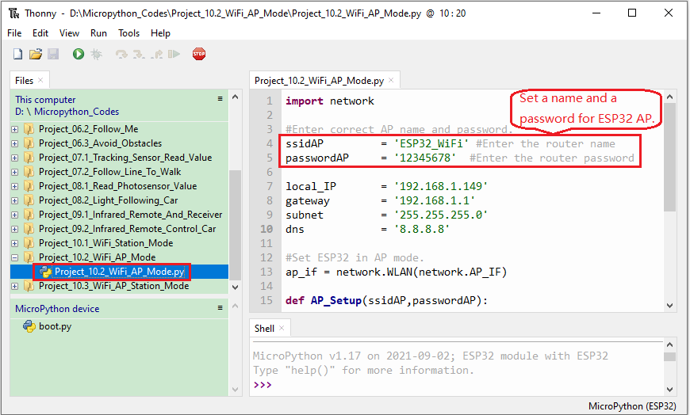

<table>
<tbody>
<tr class="odd">
<td>
import network

#Enter correct AP name and password.

ssidAP = 'ESP32_WiFi' #Enter the router name

passwordAP = '12345678' #Enter the router password

local_IP = '192.168.1.149'

gateway = '192.168.1.1'

subnet = '255.255.255.0'

dns = '8.8.8.8'

#Set ESP32 in AP mode.

ap_if = network.WLAN(network.AP_IF)

def AP_Setup(ssidAP,passwordAP):

ap_if.ifconfig([local_IP,gateway,subnet,dns]) #Configure IP address, gateway and subnet mask for ESP32.

print("Setting soft-AP ... ")

#Turn on an AP in ESP32, whose name is set by ssid_AP and password is set by password_AP

ap_if.config(essid=ssidAP,authmode=network.AUTH_WPA_WPA2_PSK, password=passwordAP)

ap_if.active(True)

print('Success, IP address:', ap_if.ifconfig())

print("Setup End\n")

try:

AP_Setup(ssidAP,passwordAP)

except:

print("Failed, please disconnect the power and restart the operation.")

ap_if.disconnect() #If the program is running abnormally, the AP disconnection function will be called.
</td>
</tr>
</tbody>
</table>

**4.Test Result**

You can modify the AP name and password or keep them unchanged

Click “Run current script”, the code will be run.
Open the AP function of the ESP32, the Shell monitor will print the
information

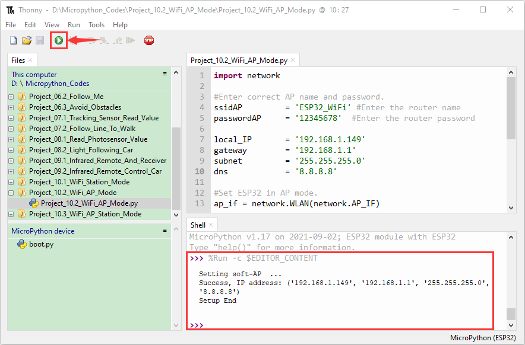

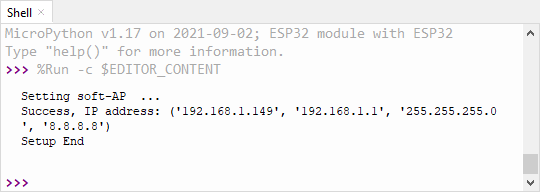

Enable Wifi, then you can see the ssid\_AP which is called "ESP32\_Wifi"
in this code. You can enter the password "12345678" to connect it, or
you can modify its AP name and password by code.

### Project 10.3：WIFI AP+Station Mode

1.  **Component Knowledge：**

**AP+Station mode**

In addition to the AP mode and the Station mode, **AP+Station mode** can
be used at the same time. Turn on the Station mode of the ESP32, connect
it to the router network, and it can communicate with the Internet
through the router. Then turn on the AP mode to create a hotspot
network. Other WiFi devices can be connected to the router network or
the hotspot network to communicate with the ESP32.

**2. Test Code：**

You can download test code from a link
[https://fs.keyestudio.com/KS50](https://fs.keyestudio.com/KS0470)02 You
can save the code anywhere. We save the code in the drive D of our
computer.

As shown below: D:\\Micropython\_Codes.

Open“Thonny”and click“This
computer”→“D:”→“Micropython\_Codes”→“Project\_10.3\_WiFi\_AP\_Station\_Mode”

Double-click Project\_10.3\_WiFi\_AP\_Station\_Mode.py as shown below:

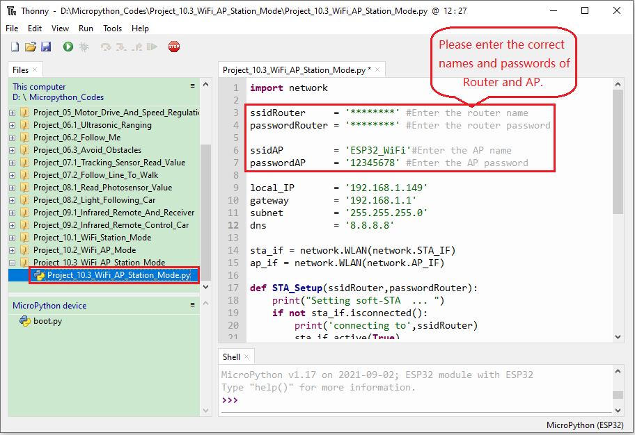

<table>
<tbody>
<tr class="odd">
<td>
import network

ssidRouter = '********' #Enter the router name

passwordRouter = '********' #Enter the router password

ssidAP = 'ESP32_WiFi'#Enter the AP name

passwordAP = '12345678' #Enter the AP password

local_IP = '192.168.1.149'

gateway = '192.168.1.1'

subnet = '255.255.255.0'

dns = '8.8.8.8'

sta_if = network.WLAN(network.STA_IF)

ap_if = network.WLAN(network.AP_IF)

def STA_Setup(ssidRouter,passwordRouter):

print("Setting soft-STA ... ")

if not sta_if.isconnected():

print('connecting to',ssidRouter)

sta_if.active(True)

sta_if.connect(ssidRouter,passwordRouter)

while not sta_if.isconnected():

pass

print('Connected, IP address:', sta_if.ifconfig())

print("Setup End")

def AP_Setup(ssidAP,passwordAP):

ap_if.ifconfig([local_IP,gateway,subnet,dns])

print("Setting soft-AP ... ")

ap_if.config(essid=ssidAP,authmode=network.AUTH_WPA_WPA2_PSK, password=passwordAP)

ap_if.active(True)

print('Success, IP address:', ap_if.ifconfig())

print("Setup End\n")

try:

AP_Setup(ssidAP,passwordAP)

STA_Setup(ssidRouter,passwordRouter)

except:

sta_if.disconnect()

ap_if.idsconnect()
</td>
</tr>
</tbody>
</table>

**3. Test Result**

Before running the code, you need to modify ssidRouter, passwordRouter,
ssidAP, and passwordAP. After making sure that the code is modified
correctly, click , the code starts to run, and
the "Shell" window will display the following:

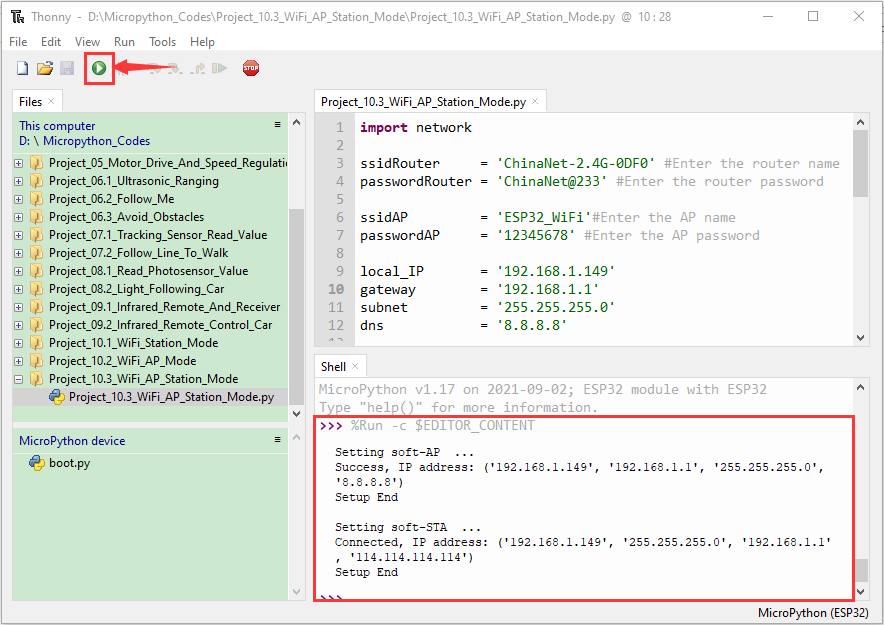

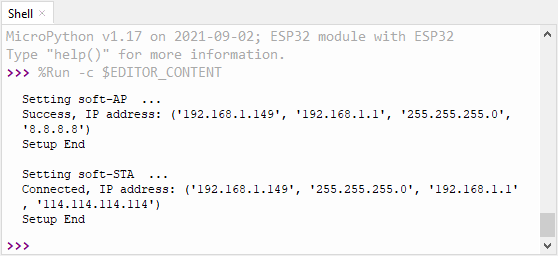

Enable WiFi, then you can see ssid\_AP on the ESP 32 board.

# 

**8. Resources**

Download code,libraries and more details, please refer to the following
link:

[https://fs.keyestudio.com/KS50](https://fs.keyestudio.com/KS0470)02
